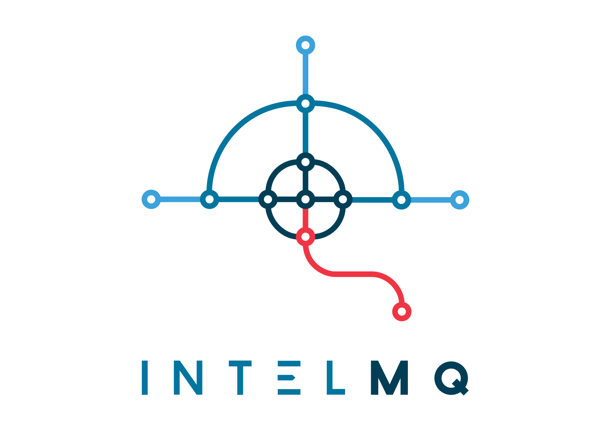

..
   SPDX-FileCopyrightText: 2020-2021 Birger Schacht
   SPDX-License-Identifier: AGPL-3.0-or-later

===================
Welcome to IntelMQ!
===================

|Build Status| |codecov.io| |CII Badge|

**IntelMQ** is a solution for IT security teams (CERTs & CSIRTs, SOCs, abuse
departments, etc.) for collecting and processing security feeds (such as
log files) using a message queuing protocol. It's a community driven
initiative called **IHAP** (Incident Handling Automation Project) which
was conceptually designed by European CERTs/CSIRTs during several
InfoSec events. Its main goal is to give to incident responders an easy
way to collect & process threat intelligence thus improving the incident
handling processes of CERTs.

IntelMQ can be used for
- automated incident handling
- situational awareness
- automated notifications
- as data collector for other tools
- etc.

IntelMQ's design was influenced by `AbuseHelper <https://github.com/abusesa/abusehelper>`__,
however it was re-written from scratch and aims at:

-  Reducing the complexity of system administration
-  Reducing the complexity of writing new bots for new data feeds
-  Reducing the probability of events lost in all process with
   persistence functionality (even system crash)
-  Use and improve the existing Data Harmonization Ontology
-  Use JSON format for all messages
-  Provide easy way to store data into Log Collectors like
   ElasticSearch, Splunk, databases (such as PostgreSQL)
-  Provide easy way to create your own black-lists
-  Provide easy communication with other systems via HTTP RESTful API

It follows the following basic meta-guidelines:

-  Don't break simplicity - KISS
-  Keep it open source - forever
-  Strive for perfection while keeping a deadline
-  Reduce complexity/avoid feature bloat
-  Embrace unit testing
-  Code readability: test with unexperienced programmers
-  Communicate clearly

For support questions please reach out on the `the intelmq-users mailing list <https://lists.cert.at/cgi-bin/mailman/listinfo/intelmq-users>`_

==============================
IntelMQ Manager and more tools
==============================

Several pieces of software evolved around IntelMQ. For example, check out `IntelMQ Manager <https://github.com/certtools/intelmq-manager>`_ which is a web based interface to easily manage an IntelMQ system.

More tools can be found in the `Ecosystem chapter in the documentation <https://intelmq.readthedocs.io/en/latest/user/ecosystem.html>`_.

==================
How to participate
==================

IntelMQ is a community project depending on your contributions. Please consider sharing your work.

- Have a look at our `Developers Guide <https://intelmq.readthedocs.io/en/latest/dev/guide.html>`_ for documentation.
- Subscribe to the `Intelmq-dev Mailing list <https://lists.cert.at/cgi-bin/mailman/listinfo/intelmq-dev>`_ to get answers to your development questions:
- The `Github issues <https://github.com/certtools/intelmq/issues/>`_ lists all the open feature requests, bug reports and ideas.
- Some developers are also on IRC: `channel #intelmq on irc.freenode.net <ircs://chat.freenode.net:6697/intelmq>`__.

====================================
Incident Handling Automation Project
====================================

- **URL:** http://www.enisa.europa.eu/activities/cert/support/incident-handling-automation
- **Mailing-list:** ihap@lists.trusted-introducer.org

=======
Licence
=======

This software is licensed under GNU Affero General Public License version 3

=======
Funding
=======

This project was partially funded by the CEF framework

.. figure:: https://ec.europa.eu/inea/sites/default/files/ceflogos/en_horizontal_cef_logo_2.png
   :alt: Co-financed by the Connecting Europe Facility of the European Union

.. |Build Status| image:: https://github.com/certtools/intelmq/workflows/Nosetest%20test%20suite/badge.svg
   :target: https://github.com/certtools/intelmq/actions
.. |codecov.io| image:: https://codecov.io/github/certtools/intelmq/coverage.svg?branch=develop
   :target: https://codecov.io/github/certtools/intelmq?branch=master
.. |CII Badge| image:: https://bestpractices.coreinfrastructure.org/projects/4186/badge
   :target: https://bestpractices.coreinfrastructure.org/projects/4186/
