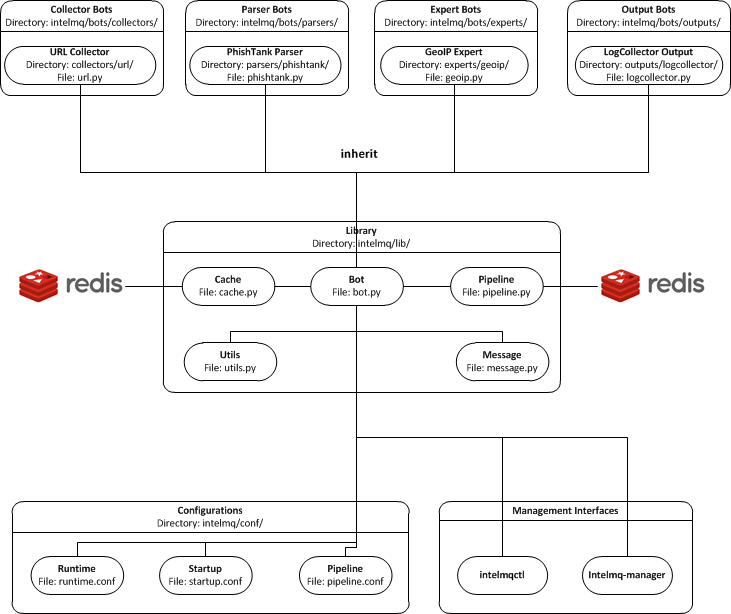

**Table of Contents**

* [Intended Audience](#intended-audience)
  * [Goals](#goals)
* [Development Environment](#development-environment)
  * [Installation](#installation)
  * [Testing](#testing)
* [Development Guidelines](#development-guidelines)
  * [Coding-Rules](#coding-rules)
    * [Unicode](#unicode)
    * [Back-end independence](#back-end-independence)
    * [Compatibility](#compatibility)
  * [Layout Rules](#layout-rules)
    * [Directories Hierarchy on Default Installation](#directories-hierarchy-on-default-installation)
    * [Directories and Files naming](#directories-and-files-naming)
    * [Class Names](#class-names)
  * [Data Harmonization Rules](#data-harmonization-rules)
  * [Code Submission Rules](#code-submission-rules)
    * [Releases, Repositories and Branches](#releases-repositories-and-branches)
    * [How to Contribute](#how-to-contribute)
    * [Workflow](#workflow)
    * [Commit Messages](#commit-messages)
    * [Prepare for Discussion in GitHub](#prepare-for-discussion-in-github)
  * [License and Author files](#license-and-author-files)
* [System Overview](#system-overview)
  * [Code Architecture](#code-architecture)
  * [Pipeline](#pipeline)
* [Bot Developer Guide](#bot-developer-guide)
  * [Template](#template)
  * [Pipeline interactions](#pipeline-interactions)
  * [Logging](#logging)
    * [Log Messages Format](#log-messages-format)
    * [Log Levels](#log-levels)
    * [What to Log](#what-to-log)
    * [How to Log](#how-to-log)
  * [Error handling](#error-handling)
  * [Initialization](#initialization)
  * [Examples](#examples)
  * [Parsers](#parsers)
  * [Tests](#tests)
  * [Configuration](#configuration)

# Intended Audience
This guide is for developers of IntelMQ. It explains the code architecture, coding guidelines as well as ways you can contribute code or documentation.
If you have not done so, please read the [User Guide](User-Guide.md) first.
Once you feel comfortable running IntelMQ with open source bots and you feel adventurous enough to contribute to the project, this guide is for you.
It does not matter if you are an experienced Python programmer or just a beginner. There are a lot of samples to help you out.

Hoever, before we go into the details, it is important to observe and internalise some overall project goals.

## Goals

It is important, that all developers agree and stick to these meta-guidelines. 
IntelMQ tries to:

* Be well tested. For developers this means, we expect you to write unit tests for bots. Every time.
* Reduce the complexity of system administration
* Reduce the complexity of writing new bots for new data feeds
* Make your code easily and pleasantly readable
* Reduce the probability of events lost in all process with persistence functionality (even system crash)
* Strictly adhere to the existing [Data Harmonization Ontology](Data-Harmonization.md) for key-values in events
* Always use JSON format for all messages internally
* Help and support the interconnection between IntelMQ and existing tools like AbuseHelper, CIF, etc. or new tools (in other words: we will not accept data-silos!)
* Provide an easy way to store data into Log Collectors like ElasticSearch, Splunk
* Provide an easy way to create your own black-lists
* Provide easy to understand interfaces with other systems via HTTP RESTFUL API

The main take away point from the list above is: things **MUST** stay __intuitive__ and __easy__.
How do you ultimately test if things are still easy? Let them new programmers test-drive your features and if it is not understandable in 15 minutes, go back to the drawing board.

Similarly, if code does not get accepted upstream by the main developers, it is usually only because of the ease-of-use argument. Do not give up , go back to the drawing board, and re-submit again.


# Development Environment

## Installation
Developers might want to install intelmq with `pip3 -e`, which gives you a so called *editable* installation. No code is copied in the libraries directories, there's just a link to your code.

    pip3 install -e .

## Update

If you do any changes on setup.py, data files (e.g. example configurations) or add new bots, you need to rerun the installation routine.

    pip3 install --upgrade -e .

## Testing

All changes have to be tested and new contributions must be accompanied by according unit tests. You can run the tests by changing to the directory with intelmq repository and running either `unittest` or `nosetests`:

    cd intelmq
    python3 -m unittest {discover|filename}  # or
    nosetests3 [filename]  # or
    python3 setup.py test  # uses a build environment

It may be necessary to switch the user to `intelmq` if the run-path (`/opt/intelmq/var/run/`) is not writeable by the current user. Some bots need local databases to succeed. If you don't mind about those and only want to test one explicit test file, give the filepath as argument.

There is a [Travis-CI](https://travis-ci.org/certtools/intelmq/builds) setup for automatic testing, which triggers on pull requests. You can also easily activate it for your forks.


# Development Guidelines

## Coding-Rules

Most important: **KEEP IT SIMPLE**!!
This can not be over-estimated. Feature creep can destroy any good software project. But if new folks can not understand what you wrote in 10-15 minutes, it is not good. It's not about the performance, etc. It's about readability.


In general, we follow the [Style Guide for Python Code (PEP8)](https://www.python.org/dev/peps/pep-0008/).
We recommend reading it before committing code.

There are some exceptions: sometimes it does not make sense to check for every PEP8 error (such as whitespace indentation when you want to make a dict=() assignment
look pretty. Therefore, we do have some exceptions defined in the `setup.cfg` file.

We support Python 3 only.

### Unicode

* Each internal object in IntelMQ (Event, Report, etc) that has strings, their strings MUST be in UTF-8 Unicode format.
* Any data received from external sources MUST be transformed into UTF-8 unicode format before add it to IntelMQ objects.

### Back-end independence

Any component of the IntelMQ MUST be independent of the message queue technology (Redis, RabbitMQ, etc...), except `lib/pipeline.py`. Intelmq bots MAY only assume to use the class specified in `lib/pipeline.py` and `lib/cache.py` for inter-process or inter-bot communications.

### Compatibility

IntelMQ core (including intelmqctl) MUST be compatible with IntelMQ Manager.


## Layout Rules

```bash
intelmq/
  lib/
    bot.py
    cache.py
    message.py
    pipeline.py
    utils.py
  bots/
    collector/
      <bot name>/
            collector.py
    parser/
      <bot name>/
            parser.py
    expert/
      <bot name>/
            expert.py
    output/
      <bot name>/
            output.py
    BOTS
  /conf
    pipeline.conf
    runtime.conf
    system.conf
```

Assuming you want to create a bot for a new 'Abuse.ch' feed. It turns out that here it is necessary to create different parsers for the respective kind of events (e.g. malicious URLs). Therefore, the usual hierarchy ‘intelmq/bots/parser/<FEED>/parser.py’ would not be suitable because it is necessary to have more parsers for each Abuse.ch Feed. The solution is to use the same hierarchy with an additional "description" in the file name, separated by underscore. Also see the section *Directories and Files naming*.

Example (including the current ones):
```
/intelmq/bots/parser/abusech/parser_domain.py
/intelmq/bots/parser/abusech/parser_ip.py
/intelmq/bots/parser/abusech/parser_ransomware.py

/intelmq/bots/parser/abusech/parser_malicious_url.py
```

### Directories Hierarchy on Default Installation

* Configuration Files Path: `/opt/intelmq/etc/`
* PID Files Path: `/opt/intelmq/var/run/`
* Logs Files and dumps Path: `/opt/intelmq/var/log/`
* Additional Bot Files Path, e.g. templates or databases: `/opt/intelmq/var/lib/bots/[bot-name]/`

### Directories and Files naming

Any directory and file of IntelMQ has to follow the Directories and Files naming. Any file name or folder name has to
* be represented with lowercase and in case of the name has multiple words, the spaces between them must be removed or replaced by underscores;
* be self-explaining what the content contains.

In the bot directories name, the name must correspond to the feed name. If necessary, some words can be added to give context by joining together using underscores.

Example (without context words):
```
intelmq/bots/parser/dragonresearchgroup
intelmq/bots/parser/malwaredomainlist
```

Example (with context words):
```
intelmq/bots/parser/cymru_full_bogons
intelmq/bots/parser/taichung_city_netflow
```

### Class Names

Class name of the bot (ex: PhishTank Parser) must correspond to the type of the bot (ex: Parser) e.g. `PhishTankParserBot`


## Data Harmonization Rules

Any component of IntelMQ MUST respect the "Data Harmonization Ontology".

**Reference:** IntelMQ Data Harmonization - [Data Harmonization Ontology](Data-Harmonization.md)


## Code Submission Rules

### Releases, Repositories and Branches

  * The main repository is in [github.com/certtools/intelmq](https://github.com/certtools/intelmq).
  * There are a couple of forks which might be regularly merged into the main repository. They are independent and can have incompatible changes and can deviate from the upstream repository.
  * The "master" branch is the current development branch for the next feature release. Releases are tagged as release branch together with release branches for bugfixes and bugfix releases.
  * We use [semantic versioning](http://semver.org/).
  * Releases shall receive non-breaking bug fixes. The "master" branch can change and might introduce non-compatible changes.
  * If you contribute something, please fork the repository and create a separate branch and use this for pull requests, see section below.

### How to Contribute

  * Make separate pull requests / branches on github for changes. This allows us to discuss things via github.
  * We prefer one  Pull Request per feature or change. If you have a bunch of small fixes, please don't create one RP per fix :)
  * Only very small and changes (docs, ...) might be commited directly to development branches without Pull Request by the [core-team](https://github.com/orgs/certtools/teams/core).
  * Keep the balance betweeen atomic commits and keeping the amount of commits per PR small. You can use interactive rebasing to squash multiple small commits into one. (`rebase -i master`)
  * Make sure your PR is mergeable in the master branch and all tests are successfull.
  * If possible [sign your commits with GPG](https://help.github.com/articles/signing-commits-using-gpg/).

### Workflow

We assume here, that origin is your own fork. We first add the upstream repository:

```bash
> git remote add upstream https://github.com/certtools/intelmq.git
```

Syncing master:

```bash
> git checkout master
> git pull upstream master
> git push origin master

```
Create a separate feature-branch to work on, sync master with upstream. Create working branch from master:
```bash
> git checkout master
> git checkout -b bugfix
# your work
> git commit
```

Gettting upstream's changes:
```bash
> git checkout master
> git pull upstream master
> git push origin master
```
There are 2 possibilities to get upstream's commits into your branch. Rebasing and Merging. Using rebasing, your history is rewritten, putting your changes on top of all other commits. You can use this if your changes are not published yet (or only in your fork).
```bash
> git checkout bugfix
> git rebase master
```
Using the `-i` flag for rebase enables interactive rebasing. You can then remove, reorder and squash commits, rewrite commit messages, beginning with the given branch, e.g. master.

Or using merging. This doesn't break the history. It's considered more , but also pollutes the history with merge commits.
```bash
> git checkout bugfix
> git merge master
```

Also see the [development workflow of Scipy](https://docs.scipy.org/doc/numpy/dev/gitwash/development_workflow.html) which has more examples.

You can then create a PR with your branch `bugfix` to our upstream repository, using github's webinterface.

### Commit Messages

If it fixes an existing issue, please use github syntax, e.g.: `fixes certtools/intelmq#<IssueID>`

### Prepare for Discussion in GitHub

If we don't discuss it, it's probably not tested.

## License and Author files

License and Authors files can be found at the root of repository.
* License file **MUST NOT** be modified except by the explicit written permission by CNCS/CERT.PT or CERT.at
* Credit to the authors file must be always retained. When a new contributor (person and/or organization) improves in some way the repository content (code or documentation), he or she might add his name to the list of contributors.

License and authors must be only listed in an external file but not inside the code files.


# System Overview

In the `intelmq/lib/` directory you can find some libraries:
 * Bots: Defines base structure for bots and handling of startup, stop, messages etc.
 * Cache: For some expert bots it does make sense to cache external lookup results. Redis is used here.
 * Harmonization: For defined types, checks and sanitation methods are implemented.
 * Message: Defines Events and Reports classes, uses harmonization to check validity of keys and values according to config.
 * Pipeline: Writes messages to message queues. Implemented for productions use is only Redis. A python-only solution is used by testing. A solution using ZMQ is in development.
 * Test: Base class for bot tests with predefined test and assert methods.
 * Utils: Utility functions used by system components.

## Code Architecture



## Pipeline

  * collector bot
  **TBD**


# Bot Developer Guide

There's a dummy bot including tests at `intelmq/tests/lib/test_parser_bot.py`.

You can always start any bot directly from command line by calling the executable.
The executable will be created during installation a directory for binaries. After adding new bots to the code, install IntelMQ to get the files created.
Don't forget to give an bot id as first argument. Also, running bots with other users than `intelmq` will raise permission errors.
```bash
$ sudo -i intelmq
$ intelmqctl run file-output  # if configured
$ intelmq.bots.outputs.file.output file-output
```
You will get all logging outputs directly on stderr as well as in the log file.

## Template
Please adjust the doc strings accordingly and remove the in-line comments (`#`).
```python
# -*- coding: utf-8 -*-
"""
ExampleParserBot parses data from example.com.

Document possible necessary configurations.
"""
from __future__ import unicode_literals
import sys

# imports for additional libraries and intelmq
from intelmq.lib.bot import Bot


class ExampleParserBot(Bot):
    def process(self):
        report = self.receive_message()

        event = self.new_event(report)  # copies feed.name, time.observation
        ... # implement the logic here
        event.add('source.ip', '127.0.0.1')
        event.add('extra', {"os.name": "Linux"})

        self.send_message(event)
        self.acknowledge_message()


BOT = ExampleParserBot
```

There are some names with special meaning. These can be used i.e. called:
* `stop`: Shuts the bot down.
* `receive_message`, `send_message`, `acknowledge_message`: see next section
* `parameters`: the bots configuration as object
* `start`: internal method to run the bot

These can be defined:
* `init`: called at startup, use it to set up the bot (initializing classes, loading files etc)
* `process`: processes the messages
* `shutdown`: To Gracefully stop the bot, e.g. terminate connections

All other names can be used freely.

## Pipeline interactions

A can call three methods related to the pipeline:

  - `self.receive_message()`: The pipeline handler pops one message from the internal queue if possible. Otherwise one message from the sources list is popped, and added it to an internal queue. In case of errors in process handling, the message can still be found in the internal queue and is not lost. The bot class unravels the message a creates an instance of the Event or Report class.
  - `self.send_message(event)`: Processed message is sent to destination queues.
  - `self.acknowledge_message()`: Message formerly received by `receive_message` is removed from the internal queue. This should always be done after processing and after the sending of the new message. In case of errors, this function is not called and the message will stay in the internal queue waiting to be processed again.

## Logging

### Log Messages Format

Log messages have to be clear and well formatted. The format is the following:

Format:
```
<timestamp> - <bot id> - <log level> - <log message>
```

Rules:
* the Log message MUST follow the common rules of a sentence, beginning with uppercase and ending with period.
* the sentence MUST describe the problem or has useful information to give to an unexperienced user a context. Pure stack traces without any further explanation are not helpful.

When the logger instance is created, the bot id must be given as parameter anyway. The function call defines the log level, see below.

### Log Levels

* *debug*: Debugging informations includes retrieved and sent messages, detailed status information. Can include sensitive information like passwords and amount can be huge.
* *info*: Logs include loaded databases, fetched reports or waiting messages.
* *warning*: Unexpected, but handled behavior.
* *error*: Errors and Exceptions.
* *critical* Program is failing.

### What to Log

* Try to keep a balance between obscuring the source code file with hundreds of log messages and having too little log messages. 
* In general, a bot MUST report error conditions.

### How to Log
The Bot class creates a logger with that should be used by bots. Other components won't log anyway currently. Examples:

```python
self.logger.info('Bot start processing')
self.logger.error('Pipeline failed')
self.logger.exception('Pipeline failed')
```
The `exception` method automatically appends an exception traceback. The logger instance writes by default to the file `/opt/intelmq/var/log/[bot-id].log` and to stderr.

## Error handling

The bot class itself has error handling implemented. The bot itself is allowed to throw exceptions and **intended to fail**! The bot should fail in case of malicious messages, and in case of unavailable but necessary resources. The bot class handles the exception and will restart until the maximum number of tries is reached and fail then. Additionally, the message in question is dumped to the file `/opt/intelmq/var/log/[bot-id].dump` and removed from the queue.

## Initialization

Maybe it is necessary so setup a Cache instance or load a file into memory. Use the `init` function for this purpose:

```python
class ExampleParserBot(Bot):
    def init(self):
        try:
            self.database = pyasn.pyasn(self.parameters.database)
        except IOError:
            self.logger.error("pyasn data file does not exist or could not be "
                              "accessed in '%s'." % self.parameters.database)
            self.logger.error("Read 'bots/experts/asn_lookup/README.md' and "
                              "follow the procedure.")
            self.stop()
```

## Examples

* Check [Expert Bots](../intelmq/bots/experts/)
* Check [Parser Bots](../intelmq/bots/parsers/)

## Parsers

Parsers can use a different, specialized Bot-class. It allows to work on individual elements of a report, splitting the functionality of the parser into multiple functions:

 * `process`: getting and sending data, handling of failures etc.
 * `parse`: Parses the report and splits it into single elements (e.g. lines). Can be overridden.
 * `parse_line`: Parses elements, returns an Event. Can be overridden.
 * `recover_line`: In case of failures and for the field `raw`, this function recovers a fully functional report containing only one element. Can be overridden.

For common cases, like CSV, exisiting function can be used, reducing the amount of code to implement. In the best case, only `parse_line` needs to be coded, as only this part interprets the data.

You can have a look at the implementation `intelmq/lib/bot.py` or at examples, e.g. the DummyBot in `intelmq/tests/lib/test_parser_bot.py`. This is a stub for creating a new Parser, showing the parameters and possible code:

```python
class MyParserBot(ParserBot):

    def parse(self, report):
        """
        A generator yielding the single elements of the data.

        Comments, headers etc. can be processed here. Data needed by
        `self.parse_line` can be saved in `self.tempdata` (list).

        Default parser yields stripped lines.
        Override for your use or use an exisiting parser, e.g.:
            parse = ParserBot.parse_csv
        """
        for line in utils.base64_decode(report.get("raw")).splitlines():
            yield line.strip()

    def parse_line(self, line, report):
        """
        A generator which can yield one or more messages contained in line.

        Report has the full message, thus you can access some metadata.
        Override for your use.
        """
        raise NotImplementedError

    def process(self):
        self.tempdata = []  # temporary data for parse, parse_line and recover_line
        self.__failed = []
        report = self.receive_message()

        for line in self.parse(report):
            if not line:
                continue
            try:
                # filter out None
                events = list(filter(bool, self.parse_line(line, report)))
            except Exception as exc:
                self.logger.exception('Failed to parse line.')
                self.__failed.append((exc, line))
            else:
                self.send_message(*events)

        for exc, line in self.__failed:
            self._dump_message(exc, self.recover_line(line))

        self.acknowledge_message()

    def recover_line(self, line):
        """
        Reverse of parse for single lines.

        Recovers a fully functional report with only the problematic line.
        """
        return '\n'.join(self.tempdata + [line])


BOT = MyParserBot
```

### parse_line
One line can lead to multiple events, thus `parse_line` can't just return one Event. Thus, this function is a generator, which allows to easily return multiple values. Use `yield event` for valid Events and `return` in case of a void result (not parseable line, invalid data etc.).

## Tests

In order to do automated tests on the bot, it is necessary to write tests including sample data. Have a look at some existing tests:

 - The DummyParserBot in `intelmq/tests/lib/test_paerser_bot.py`. This test has the example data (report and event) inside the file, defined as dictionary.
 - The parser for malwaregroup at `intelmq/tests/bots/parsers/malwaregroup/test_parser_*.py`. The latter loads a sample HTML file from the same directory, which is the raw report.
 - The test for ASNLookupExpertBot has two event tests, one is an expected fail (IPv6).

Ideally an example contains not only the ideal case which should succeed, but also a case where should fail instead. (TODO: Implement assertEventNotEqual or assertEventNotcontainsSubset or similar)
Most existing bots are only tested with one message. For newly written test it is appreciable to have tests including more then one message, e.g. a parser fed with an report consisting of multiple events.

```python
# -*- coding: utf-8 -*-
from __future__ import unicode_literals

import unittest

import intelmq.lib.test as test
from intelmq.bots.parsers.exampleparser.parser import ExampleParserBot  # adjust bot class name and module


class TestExampleParserBot(test.BotTestCase, unittest.TestCase):  # adjust test class name
    """
    A TestCase for ExampleParserBot.
    """

    @classmethod
    def set_bot(cls):
        cls.bot_reference = ExampleParserBot  # adjust bot class name
        cls.default_input_message = EXAMPLE_EVENT  # adjust source of the example event (dict), by default an empty event or report (depeding on bot type)

    # This is an example how to test the log output
    def test_log_test_line(self):
        """ Test if bot does log example message. """
        self.run_bot()
        self.assertRegexpMatches(self.loglines_buffer,
                                 "INFO - Lorem ipsum dolor sit amet")

    def test_event(self):
        """ Test if correct Event has been produced. """
        self.run_bot()
        self.assertMessageEqual(0, EXAMPLE_REPORT)


if __name__ == '__main__':  # pragma: no cover
    unittest.main()
```

When calling the file directly, only the tests in this file for the bot will be expected. Some default tests are always executed (via the `test.BotTestCase` class), such as pipeline and message checks, logging, bot naming or empty message handling.

## Configuration

In the end, the new information about the new bot should be added to BOTS file
located at `intelmq/bots`. Note that the file is sorted!
**Table of Contents**

* [Intended Audience](#intended-audience)
  * [Goals](#goals)
* [Development Environment](#development-environment)
  * [Installation](#installation)
  * [Testing](#testing)
* [Development Guidelines](#development-guidelines)
  * [Coding-Rules](#coding-rules)
    * [Unicode](#unicode)
    * [Back-end independence](#back-end-independence)
    * [Compatibility](#compatibility)
  * [Layout Rules](#layout-rules)
    * [Directories Hierarchy on Default Installation](#directories-hierarchy-on-default-installation)
    * [Directories and Files naming](#directories-and-files-naming)
    * [Class Names](#class-names)
  * [Data Harmonization Rules](#data-harmonization-rules)
  * [Code Submission Rules](#code-submissions-rules)
    * [Releases, Repositories and Branches](#releases-repositories-and-branches)
    * [How to Contribute](#how-to-contribute)
    * [Workflow](#workflow)
    * [Commit Messages](#commit-messages)
    * [Prepare for Discussion in GitHub](#prepare-for-discussion-in-github)
  * [License and Author files](#license-and-author-files)
* [System Overview](#system-overview)
  * [Code Architecture](#code-architecture)
  * [Pipeline](#pipeline)
* [Bot Developer Guide](#bot-developer-guide)
  * [Template](#template)
  * [Pipeline interactions](#pipeline-interactions)
  * [Logging](#logging)
    * [Log Messages Format](#log-messages-format)
    * [Log Levels](#log-levels)
    * [What to Log](#what-to-log)
    * [How to Log](#how-to-log)
  * [Error handling](#error-handling)
  * [Initialization](#initialization)
  * [Examples](#examples)
  * [Parsers](#parsers)
  * [Tests](#tests)
  * [Configuration](#configuration)

# Intended Audience
This guide is for developers of IntelMQ. It explains the code architecture, coding guidelines as well as ways you can contribute code or documentation.
If you have not done so, please read the [User Guide](User-Guide.md) first.
Once you feel comfortable running IntelMQ with open source bots and you feel adventurous enough to contribute to the project, this guide is for you.
It does not matter if you are an experienced Python programmer or just a beginner. There are a lot of samples to help you out.

Hoever, before we go into the details, it is important to observe and internalise some overall project goals.

## Goals

It is important, that all developers agree and stick to these meta-guidelines. 
IntelMQ tries to:

* Be well tested. For developers this means, we expect you to write unit tests for bots. Every time.
* Reduce the complexity of system administration
* Reduce the complexity of writing new bots for new data feeds
* Make your code easily and pleasantly readable
* Reduce the probability of events lost in all process with persistence functionality (even system crash)
* Strictly adhere to the existing [Data Harmonization Ontology](Data-Harmonization.md) for key-values in events
* Always use JSON format for all messages internally
* Help and support the interconnection between IntelMQ and existing tools like AbuseHelper, CIF, etc. or new tools (in other words: we will not accept data-silos!)
* Provide an easy way to store data into Log Collectors like ElasticSearch, Splunk
* Provide an easy way to create your own black-lists
* Provide easy to understand interfaces with other systems via HTTP RESTFUL API

The main take away point from the list above is: things **MUST** stay __intuitive__ and __easy__.
How do you ultimately test if things are still easy? Let them new programmers test-drive your features and if it is not understandable in 15 minutes, go back to the drawing board.

Similarly, if code does not get accepted upstream by the main developers, it is usually only because of the ease-of-use argument. Do not give up , go back to the drawing board, and re-submit again.


# Development Environment

## Installation
Developers might want to install intelmq with `pip3 -e`, which gives you a so called *editable* installation. No code is copied in the libraries directories, there's just a link to your code.

    pip3 install -e .

If you do any changes on setup.py, data files (e.g. example configurations), you need to run the installation again of course.


## Testing

All changes have to be tested and new contributions must be accompanied by according unit tests. You can run the tests by changing to the directory with intelmq repository and running either `unittest` or `nosetests`:

    cd intelmq
    python3 -m unittest {discover|filename}  # or
    nosetests3 [filename]  # or
    python3 setup.py test  # uses a build environment

It may be necessary to switch the user to `intelmq` if the run-path (`/opt/intelmq/var/run/`) is not writeable by the current user. Some bots need local databases to succeed. If you don't mind about those and only want to test one explicit test file, give the filepath as argument.

There is a [Travis-CI](https://travis-ci.org/certtools/intelmq/builds) setup for automatic testing, which triggers on pull requests. You can also easily activate it for your forks.


# Development Guidelines

## Coding-Rules

Most important: **KEEP IT SIMPLE**!!
This can not be over-estimated. Feature creep can destroy any good software project. But if new folks can not understand what you wrote in 10-15 minutes, it is not good. It's not about the performance, etc. It's about readability.


In general, we follow the [Style Guide for Python Code (PEP8)](https://www.python.org/dev/peps/pep-0008/).
We recommend reading it before committing code.

There are some exceptions: sometimes it does not make sense to check for every PEP8 error (such as whitespace indentation when you want to make a dict=() assignment
look pretty. Therefore, we do have some exceptions defined in the `setup.cfg` file.

We support Python 3 only.

### Unicode

* Each internal object in IntelMQ (Event, Report, etc) that has strings, their strings MUST be in UTF-8 Unicode format.
* Any data received from external sources MUST be transformed into UTF-8 unicode format before add it to IntelMQ objects.

### Back-end independence

Any component of the IntelMQ MUST be independent of the message queue technology (Redis, RabbitMQ, etc...), except `lib/pipeline.py`. Intelmq bots MAY only assume to use the class specified in `lib/pipeline.py` and `lib/cache.py` for inter-process or inter-bot communications.

### Compatibility

IntelMQ core (including intelmqctl) MUST be compatible with IntelMQ Manager.


## Layout Rules

```bash
intelmq/
  lib/
    bot.py
    cache.py
    message.py
    pipeline.py
    utils.py
  bots/
    collector/
      <bot name>/
            collector.py
    parser/
      <bot name>/
            parser.py
    expert/
      <bot name>/
            expert.py
    output/
      <bot name>/
            output.py
    BOTS
  /conf
    pipeline.conf
    runtime.conf
    system.conf
```

Assuming you want to create a bot for 'Abuse.ch Zeus' feed. It turns out that here it is necessary to create different parsers for the respective kind of events (C&C, Binaries, Dropzones). Therefore, the hierarchy ‘intelmq/bots/parser/abusech/parser.py’ would not be suitable because it is necessary to have more parsers, as mentioned above. The solution is to use the same hierarchy with an additional "description" in the file name, separated by underscore. Also see the section *Directories and Files naming*.

Example:
```
/intelmq/bots/parser/abusech/parser_zeus_cc.py
/intelmq/bots/parser/abusech/parser_zeus_binaries.py
/intelmq/bots/parser/abusech/parser_zeus_dropzones.py
```

### Directories Hierarchy on Default Installation

* Configuration Files Path: `/opt/intelmq/etc/`
* PID Files Path: `/opt/intelmq/var/run/`
* Logs Files and dumps Path: `/opt/intelmq/var/log/`
* Additional Bot Files Path, e.g. templates or databases: `/opt/intelmq/var/lib/bots/[bot-name]/`

### Directories and Files naming

Any directory and file of IntelMQ has to follow the Directories and Files naming. Any file name or folder name has to
* be represented with lowercase and in case of the name has multiple words, the spaces between them must be removed or replaced by underscores;
* be self-explaining what the content contains.

In the bot directories name, the name must correspond to the feed name. If necessary, some words can be added to give context by joining together using underscores.

Example (without context words):
```
intelmq/bots/parser/dragonresearchgroup
intelmq/bots/parser/malwaredomainlist
```

Example (with context words):
```
intelmq/bots/parser/cymru_full_bogons
intelmq/bots/parser/taichung_city_netflow
```

### Class Names

Class name of the bot (ex: PhishTank Parser) must correspond to the type of the bot (ex: Parser) e.g. `PhishTankParserBot`


## Data Harmonization Rules

Any component of IntelMQ MUST respect the "Data Harmonization Ontology".

**Reference:** IntelMQ Data Harmonization - [Data Harmonization Ontology](Data-Harmonization.md)


## Code Submission Rules

### Releases, Repositories and Branches

  * The main repository is in [github.com/certtools/intelmq](https://github.com/certtools/intelmq).
  * There are a couple of forks which might be regularly merged into the main repository. They are independent and can have incompatible changes and can deviate from the upstream repository.
  * The "master" branch is the current development branch for the next feature release. Releases are tagged as release branch together with release branches for bugfixes and bugfix releases.
  * We use [semantic versioning](http://semver.org/).
  * Releases shall receive non-breaking bug fixes. The "master" branch can change and might introduce non-compatible changes.
  * If you contribute something, please fork the repository and create a separate branch and use this for pull requests, see section below.

### How to Contribute

  * Make separate pull requests / branches on github for changes. This allows us to discuss things via github.
  * We prefer one  Pull Request per feature or change. If you have a bunch of small fixes, please don't create one RP per fix :)
  * Only very small and changes (docs, ...) might be commited directly to development branches without Pull Request by the [core-team](https://github.com/orgs/certtools/teams/core).
  * Keep the balance betweeen atomic commits and keeping the amount of commits per PR small. You can use interactive rebasing to squash multiple small commits into one. (`rebase -i master`)
  * Make sure your PR is mergeable in the master branch and all tests are successfull.
  * If possible [sign your commits with GPG](https://help.github.com/articles/signing-commits-using-gpg/).

### Workflow

We assume here, that origin is your own fork. We first add the upstream repository:

```bash
> git remote add upstream https://github.com/certtools/intelmq.git
```

Syncing master:

```bash
> git checkout master
> git pull upstream master
> git push origin master

```
Create a separate feature-branch to work on, sync master with upstream. Create working branch from master:
```bash
> git checkout master
> git checkout -b bugfix
# your work
> git commit
```

Gettting upstream's changes:
```bash
> git checkout master
> git pull upstream master
> git push origin master
```
There are 2 possibilities to get upstream's commits into your branch. Rebasing and Merging. Using rebasing, your history is rewritten, putting your changes on top of all other commits. You can use this if your changes are not published yet (or only in your fork).
```bash
> git checkout bugfix
> git rebase master
```
Using the `-i` flag for rebase enables interactive rebasing. You can then remove, reorder and squash commits, rewrite commit messages, beginning with the given branch, e.g. master.

Or using merging. This doesn't break the history. It's considered more , but also pollutes the history with merge commits.
```bash
> git checkout bugfix
> git merge master
```

Also see the [development workflow of Scipy](https://docs.scipy.org/doc/numpy/dev/gitwash/development_workflow.html) which has more examples.

You can then create a PR with your branch `bugfix` to our upstream repository, using github's webinterface.

### Commit Messages

If it fixes an existing issue, please use github syntax, e.g.: `fixes certtools/intelmq#<IssueID>`

### Prepare for Discussion in GitHub

If we don't discuss it, it's probably not tested.

## License and Author files

License and Authors files can be found at the root of repository.
* License file **MUST NOT** be modified except by the explicit written permission by CNCS/CERT.PT or CERT.at
* Credit to the authors file must be always retained. When a new contributor (person and/or organization) improves in some way the repository content (code or documentation), he or she might add his name to the list of contributors.

License and authors must be only listed in an external file but not inside the code files.


# System Overview

In the `intelmq/lib/` directory you can find some libraries:
 * Bots: Defines base structure for bots and handling of startup, stop, messages etc.
 * Cache: For some expert bots it does make sense to cache external lookup results. Redis is used here.
 * Harmonization: For defined types, checks and sanitation methods are implemented.
 * Message: Defines Events and Reports classes, uses harmonization to check validity of keys and values according to config.
 * Pipeline: Writes messages to message queues. Implemented for productions use is only Redis. A python-only solution is used by testing. A solution using ZMQ is in development.
 * Test: Base class for bot tests with predefined test and assert methods.
 * Utils: Utility functions used by system components.

## Code Architecture


## Pipeline

  * collector bot
  **TBD**


# Bot Developer Guide

There's a dummy bot including tests at `intelmq/tests/lib/test_parser_bot.py`.

You can always start any bot directly from command line by calling the executable.
The executable will be created during installation a directory for binaries. After adding new bots to the code, install IntelMQ to get the files created.
Don't forget to give an bot id as first argument. Also, running bots with other users than `intelmq` will raise permission errors.
```bash
$ sudo -i intelmq
$ intelmqctl run file-output  # if configured
$ intelmq.bots.outputs.file.output file-output
```
You will get all logging outputs directly on stderr as well as in the log file.

## Template
Please adjust the doc strings accordingly and remove the in-line comments (`#`).
```python
# -*- coding: utf-8 -*-
"""
ExampleParserBot parses data from example.com.

Document possible necessary configurations.
"""
from __future__ import unicode_literals
import sys

# imports for additional libraries and intelmq
from intelmq.lib.bot import Bot


class ExampleParserBot(Bot):
    def process(self):
        report = self.receive_message()

        event = self.new_event(report)  # copies feed.name, time.observation
        ... # implement the logic here
        event.add('source.ip', '127.0.0.1')
        event.add('extra', {"os.name": "Linux"})

        self.send_message(event)
        self.acknowledge_message()


BOT = ExampleParserBot
```

There are some names with special meaning. These can be used i.e. called:
* `stop`: Shuts the bot down.
* `receive_message`, `send_message`, `acknowledge_message`: see next section
* `parameters`: the bots configuration as object
* `start`: internal method to run the bot

These can be defined:
* `init`: called at startup, use it to set up the bot (initializing classes, loading files etc)
* `process`: processes the messages
* `shutdown`: To Gracefully stop the bot, e.g. terminate connections

All other names can be used freely.

## Pipeline interactions

A can call three methods related to the pipeline:

  - `self.receive_message()`: The pipeline handler pops one message from the internal queue if possible. Otherwise one message from the sources list is popped, and added it to an internal queue. In case of errors in process handling, the message can still be found in the internal queue and is not lost. The bot class unravels the message a creates an instance of the Event or Report class.
  - `self.send_message(event)`: Processed message is sent to destination queues.
  - `self.acknowledge_message()`: Message formerly received by `receive_message` is removed from the internal queue. This should always be done after processing and after the sending of the new message. In case of errors, this function is not called and the message will stay in the internal queue waiting to be processed again.

## Logging

### Log Messages Format

Log messages have to be clear and well formatted. The format is the following:

Format:
```
<timestamp> - <bot id> - <log level> - <log message>
```

Rules:
* the Log message MUST follow the common rules of a sentence, beginning with uppercase and ending with period.
* the sentence MUST describe the problem or has useful information to give to an unexperienced user a context. Pure stack traces without any further explanation are not helpful.

When the logger instance is created, the bot id must be given as parameter anyway. The function call defines the log level, see below.

### Log Levels

* *debug*: Debugging informations includes retrieved and sent messages, detailed status information. Can include sensitive information like passwords and amount can be huge.
* *info*: Logs include loaded databases, fetched reports or waiting messages.
* *warning*: Unexpected, but handled behavior.
* *error*: Errors and Exceptions.
* *critical* Program is failing.

### What to Log

* Try to keep a balance between obscuring the source code file with hundreds of log messages and having too little log messages. 
* In general, a bot MUST report error conditions.

### How to Log
The Bot class creates a logger with that should be used by bots. Other components won't log anyway currently. Examples:

```python
self.logger.info('Bot start processing')
self.logger.error('Pipeline failed')
self.logger.exception('Pipeline failed')
```
The `exception` method automatically appends an exception traceback. The logger instance writes by default to the file `/opt/intelmq/var/log/[bot-id].log` and to stderr.

## Error handling

The bot class itself has error handling implemented. The bot itself is allowed to throw exceptions and **intended to fail**! The bot should fail in case of malicious messages, and in case of unavailable but necessary resources. The bot class handles the exception and will restart until the maximum number of tries is reached and fail then. Additionally, the message in question is dumped to the file `/opt/intelmq/var/log/[bot-id].dump` and removed from the queue.

## Initialization

Maybe it is necessary so setup a Cache instance or load a file into memory. Use the `init` function for this purpose:

```python
class ExampleParserBot(Bot):
    def init(self):
        try:
            self.database = pyasn.pyasn(self.parameters.database)
        except IOError:
            self.logger.error("pyasn data file does not exist or could not be "
                              "accessed in '%s'." % self.parameters.database)
            self.logger.error("Read 'bots/experts/asn_lookup/README.md' and "
                              "follow the procedure.")
            self.stop()
```

## Examples

* Check [Expert Bots](../intelmq/bots/experts/)
* Check [Parser Bots](../intelmq/bots/parsers/)

## Parsers

Parsers can use a different, specialized Bot-class. It allows to work on individual elements of a report, splitting the functionality of the parser into multiple functions:

 * `process`: getting and sending data, handling of failures etc.
 * `parse`: Parses the report and splits it into single elements (e.g. lines). Can be overridden.
 * `parse_line`: Parses elements, returns an Event. Can be overridden.
 * `recover_line`: In case of failures and for the field `raw`, this function recovers a fully functional report containing only one element. Can be overridden.

For common cases, like CSV, exisiting function can be used, reducing the amount of code to implement. In the best case, only `parse_line` needs to be coded, as only this part interprets the data.

You can have a look at the implementation `intelmq/lib/bot.py` or at examples, e.g. the DummyBot in `intelmq/tests/lib/test_parser_bot.py`. This is a stub for creating a new Parser, showing the parameters and possible code:

```python
class MyParserBot(ParserBot):

    def parse(self, report):
        """
        A generator yielding the single elements of the data.

        Comments, headers etc. can be processed here. Data needed by
        `self.parse_line` can be saved in `self.tempdata` (list).

        Default parser yields stripped lines.
        Override for your use or use an exisiting parser, e.g.:
            parse = ParserBot.parse_csv
        """
        for line in utils.base64_decode(report.get("raw")).splitlines():
            yield line.strip()

    def parse_line(self, line, report):
        """
        A generator which can yield one or more messages contained in line.

        Report has the full message, thus you can access some metadata.
        Override for your use.
        """
        raise NotImplementedError

    def process(self):
        self.tempdata = []  # temporary data for parse, parse_line and recover_line
        self.__failed = []
        report = self.receive_message()

        for line in self.parse(report):
            if not line:
                continue
            try:
                # filter out None
                events = list(filter(bool, self.parse_line(line, report)))
            except Exception as exc:
                self.logger.exception('Failed to parse line.')
                self.__failed.append((exc, line))
            else:
                self.send_message(*events)

        for exc, line in self.__failed:
            self._dump_message(exc, self.recover_line(line))

        self.acknowledge_message()

    def recover_line(self, line):
        """
        Reverse of parse for single lines.

        Recovers a fully functional report with only the problematic line.
        """
        return '\n'.join(self.tempdata + [line])


BOT = MyParserBot
```

### parse_line
One line can lead to multiple events, thus `parse_line` can't just return one Event. Thus, this function is a generator, which allows to easily return multiple values. Use `yield event` for valid Events and `return` in case of a void result (not parseable line, invalid data etc.).

## Tests

In order to do automated tests on the bot, it is necessary to write tests including sample data. Have a look at some existing tests:

 - The DummyParserBot in `intelmq/tests/lib/test_paerser_bot.py`. This test has the example data (report and event) inside the file, defined as dictionary.
 - The parser for malwaregroup at `intelmq/tests/bots/parsers/malwaregroup/test_parser_*.py`. The latter loads a sample HTML file from the same directory, which is the raw report.
 - The test for ASNLookupExpertBot has two event tests, one is an expected fail (IPv6).

Ideally an example contains not only the ideal case which should succeed, but also a case where should fail instead. (TODO: Implement assertEventNotEqual or assertEventNotcontainsSubset or similar)
Most existing bots are only tested with one message. For newly written test it is appreciable to have tests including more then one message, e.g. a parser fed with an report consisting of multiple events.

```python
# -*- coding: utf-8 -*-
from __future__ import unicode_literals

import unittest

import intelmq.lib.test as test
from intelmq.bots.parsers.exampleparser.parser import ExampleParserBot  # adjust bot class name and module


class TestExampleParserBot(test.BotTestCase, unittest.TestCase):  # adjust test class name
    """
    A TestCase for ExampleParserBot.
    """

    @classmethod
    def set_bot(cls):
        cls.bot_reference = ExampleParserBot  # adjust bot class name
        cls.default_input_message = EXAMPLE_EVENT  # adjust source of the example event (dict), by default an empty event or report (depeding on bot type)

    # This is an example how to test the log output
    def test_log_test_line(self):
        """ Test if bot does log example message. """
        self.run_bot()
        self.assertRegexpMatches(self.loglines_buffer,
                                 "INFO - Lorem ipsum dolor sit amet")

    def test_event(self):
        """ Test if correct Event has been produced. """
        self.run_bot()
        self.assertMessageEqual(0, EXAMPLE_REPORT)


if __name__ == '__main__':  # pragma: no cover
    unittest.main()
```

When calling the file directly, only the tests in this file for the bot will be expected. Some default tests are always executed (via the `test.BotTestCase` class), such as pipeline and message checks, logging, bot naming or empty message handling.

## Configuration

In the end, the new information about the new bot should be added to BOTS file
located at `intelmq/bots`. Note that the file is sorted!
