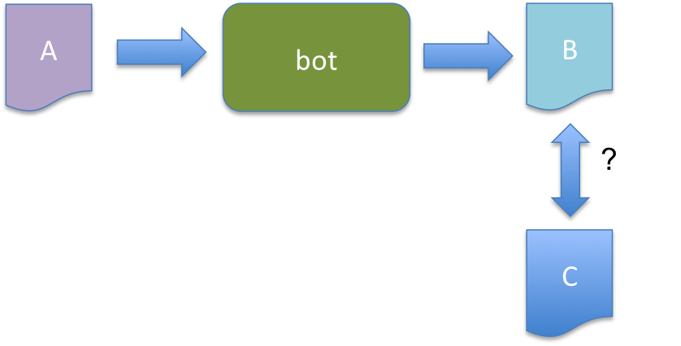

# Testing HOWTO

* Status of this document:  proposal    
* Author:                   L. Aaron Kaplan <kaplan@cert.at> 
* Last modified:            2015/06/09 

## Types of tests

### White-box unit tests

This class of tests will call individual functions or class methods and compare their output , given a fixed input against some expected output.
Example:

```
import unittest

def factorial(n):
       if (n < 0):
            return None
       if (n == 0):
            return 1
       else:
            return n * factorial(n-1) 


class TestFactorial(unittest.TestCase):
    def SetUp(self):
        pass
    def test_factorial(self):
        self.assertEqual(factorial(3), 6)
        self.assertEqual(factorial(0), 1)
        self.assertEqual(factorial(-1), None)

__name__ == '__main__':
    unittest.main()

```

Then start the test like this:

```
% python unittest_example.py -v
test_factorial (__main__.TestFactorial) ... ok

----------------------------------------------------------------------
Ran 1 test in 0.000s

OK
```

For further examples and some background reading, please take a look at the [python unittest framwork](https://docs.python.org/2/library/unittest.html)

### Black box unit (bot) tests

These types of tests allow for the testing of a complete bot **without modifications** of the bot source code. Here the idea is that a bot can get (well defined) input ("A") from a different input source (for example a file or a separate redis queue). Then it runs through its normal process() function for the whole input and produces its output ("B"). This output gets redirected and then compared against some well defined output ("C") via diff(1) or similar mechanisms.
See figure 1.

Two possible results can occur: 

  1. the diff output is zero, everything is OK, the tests passed
  2. the diff output is non-zero and...
    a. there was some error therefore the programmer must inspect the error
    b. the output is correct. The programmer must then copy "B" to "C" and check in the changes into the main repository.




Example:

```
  # code to redirect input and output message queues of a bot
$ python -m intelmq.bots.parsers.openbl.parser openbl-parser --test

(… error output in log files … )
$ echo $?
255
```
In this example, the error code 255 was returned and the bot stopped processing. The output and error messages are in the log files.


### Integration tests

An integration test, checks if a well defined intelmq setup of bots behaves in the same consistent way, given the very same input data, between different releases of intelmq. 

Lets's assume we have one version 1 and a version 2. The integration test will change the inputs of all collector bots to point to (locally hosted), well defined inputs , start the processing through the whole intelmq botnet and capture the output (for example in a special events.txt file). This is done for both versions 1 and 2. Then the outputs of version 1 and version 2 are compared. Any diffs are reported.

For this functionality to work, we need to be able to give intelmq a different set of config files.

Example:

```
$ sudo -u intelmq intelmqctl --botnet stop
$ sudo -u intelmq intelmqctl --test=integration --config /opt/intelmq/etc/testing_version1/ --botnet start
$ (… do the same for version 2)
$ diff /opt/intelmq/var/lib/bots/file-output/events1.txt /opt/intelmq/var/lib/bots/file-output/events2.txt 
$ echo $?
0

```
In this example, everything went through well , no diff, the integration test showed that everything was processed in the new version the very same was as the old version.


## When to use which tests?

By agreed upon convention, each bot:

  * **MUST** have a black box unit test with defined input and output.
  * **MAY** have white-box unit tests, however, these should be in a separate file (XXX FIXME: specify where and how XXX)

Finally, each release of intelmq **MUST** come with a complete integration test.


