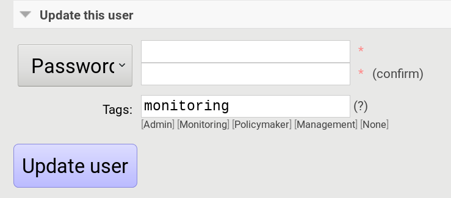

<!-- comment
   SPDX-FileCopyrightText: 2015-2023 Sebastian Wagner, Filip Pokorný
   SPDX-License-Identifier: AGPL-3.0-or-later
-->


# Beta Features

## Using Supervisor as a Process Manager

!!! warning
    Do not use it in production environments yet! It has not been tested thoroughly yet.

[Supervisor](http://supervisord.org) is process manager written in Python. The main advantage is that it take care about
processes, so if bot process exit with failure (exit code different than 0), supervisor try to run it again. Another
advantage is that it not require writing PID files.

This was tested on Ubuntu 18.04.

Install supervisor. `supervisor_twiddler` is extension for supervisor, that makes possible to create process
dynamically. (Ubuntu `supervisor`
package is currently based on Python 2, so `supervisor_twiddler` must be installed with Python 2 `pip`.)

```bash
apt install supervisor python-pip
pip install supervisor_twiddler
```

Create default config `/etc/supervisor/conf.d/intelmq.conf` and restart
`supervisor` service:

```ini
[rpcinterface:twiddler]
supervisor.rpcinterface_factory=supervisor_twiddler.rpcinterface:make_twiddler_rpcinterface

[group:intelmq]
```

Change IntelMQ process manager in the *global* configuration:

```yaml
process_manager: supervisor
```

After this it is possible to manage bots like before with `intelmqctl`
command.


## Using AMQP Message Broker

Starting with IntelMQ 1.2 the AMQP protocol is supported as message queue. To use it, install a broker, for example
RabbitMQ. The configuration and the differences are outlined here. Keep in mind that it is slower, but has better
monitoring capabilities and is more stable. The AMQP support is considered beta, so small problems might occur. So far,
only RabbitMQ as broker has been tested.

You can change the broker for single bots (set the parameters in the runtime configuration per bot) or for the whole
botnet (using the global configuration).

You need to set the parameter
`source_pipeline_broker`/`destination_pipeline_broker` to `amqp`. There are more parameters available:

!!! bug
    This section of the documentation is currently incomplete and will be updated later.

**`destination_pipeline_broker`**

(required, string) `"amqp"`


**`destination_pipeline_host`**

()  (default: `'127.0.0.1'`)

**`destination_pipeline_port`**

() (default: 5672)

**`destination_pipeline_username`**

()

**`destination_pipeline_password`**

()

**`destination_pipeline_socket_timeout`**

() (default: no timeout)

**`destination_pipeline_amqp_exchange`**

() Only change/set this if you know what you do. If set, the destination queues are not declared as queues, but used as routing key. (default: `''`).

**`destination_pipeline_amqp_virtual_host`**

() (default: `'/'`)

**`source_pipeline_host`**

() (default: `'127.0.0.1'`)


**`source_pipeline_port`**

() (default: 5672)

**`source_pipeline_username`**

()

**`source_pipeline_password`**

()

**`source_pipeline_socket_timeout`**

() (default: no timeout)

**`source_pipeline_amqp_exchange`**

() Only change/set this if you know what you do. If set, the destination queues are not declared as queues, but used as routing key. (default: ['']).


**`source_pipeline_amqp_virtual_host`**

() (default: `'/'`)

**`intelmqctl_rabbitmq_monitoring_url`**

() string, see below (default: `"http://{host}:15672"`)

For getting the queue sizes, `intelmqctl` needs to connect to the monitoring interface of RabbitMQ. If the monitoring
interface is not available under `http://{host}:15672` you can manually set using the
parameter `intelmqctl_rabbitmq_monitoring_url`. In a RabbitMQ's default configuration you might not provide a user
account, as by default the administrator (`guest`:`guest`) allows full access from localhost. If you create a separate
user account, make sure to add the tag "monitoring" to it, otherwise IntelMQ can't fetch the queue sizes.



Setting the statistics (and cache) parameters is necessary when the local redis is running under a non-default
host/port. If this is the case, you can set them explicitly:


**`statistics_database`**

() `3`

**`statistics_host`**

() `"127.0.0.1"`

**`statistics_password`**

() `null`


**`statistics_port`**

() `6379`

## Multithreading

First of all: Do not use it in production environments yet! There are a few bugs, see below

Since IntelMQ 2.0 it is possible to provide the following runtime parameter:

**`instances_threads`**

Set it to a non-zero integer, then this number of worker threads will be spawn. This is useful if bots often wait for
system resources or if network-based lookups are a bottleneck.

However, there are currently a few cavecats:

- This is not possible for all bots, there are some exceptions (collectors and some outputs), see the `FAQ` for some reasons.
- Only use it with the AMQP pipeline, as with Redis, messages may get duplicated because there's only one internal
  queue
- In the logs, you can see the main thread initializing first, then all of the threads which log with the
  name `[bot-id].[thread-id]`.


