<!-- comment
   SPDX-FileCopyrightText: 2026 Institute for Common Good Technology
   SPDX-License-Identifier: AGPL-3.0-or-later
-->

# Connecting IntelMQ instances

IntelMQ instances can be connected to each other by different methods to forward data across offices, departments, or organisations.
The same methods can also be used to connect IntelMQ with other systems.

## Use cases

### Connecting multiple IntelMQ instances in the same organization

* Separate IntelMQ instances for different purposes
* IntelMQ instances running in different departments
* Workload management, load balancing and redundancy: Especially effective with AMQP

### Data feeds

One organisation collects and processes threat intelligence with IntelMQ, providing a data feed for others to consume.
The receiving organisation ingests that feed into their own IntelMQ instance for further processing and local use.

This model is common for open data sharing initiatives or threat intelligence providers.

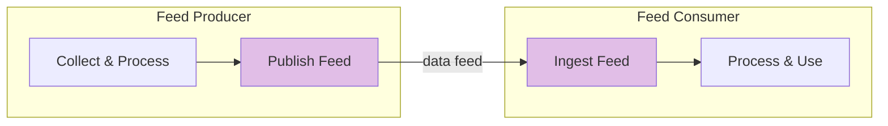

### Connections between trusted organizations

Two organizations that both use IntelMQ can route threat intelligence directly to each other without an intermediary.
Each side controls what data it sends and receives.
Both sides must agree to share data with each other.


Examples:

- International corporations forwarding indicators to national branches
- National CSIRTs distributing threat data down to federal state-level, sectoral CSIRTs or network operators
- Peer organizations in an industry sharing sector-specific threat intelligence

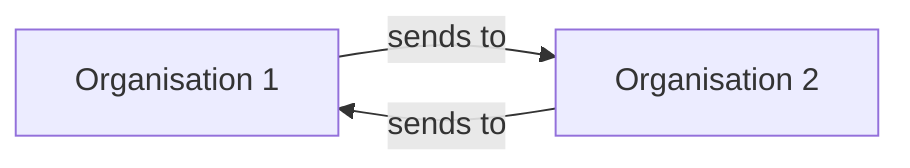

### Connections between arbitrary organizations using a central instance

A central data broker ("data hub") that is trusted by the network participants routes the information between them.

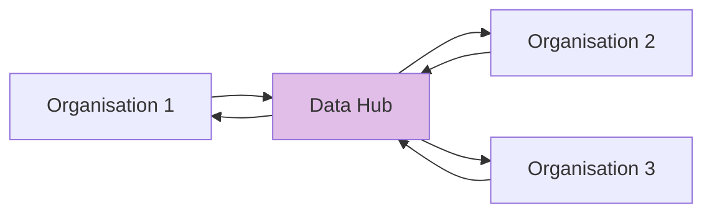

## Architecture

In all connection methods, data flows from one IntelMQ instance to another via some form of transport: either a direct connection or through an intermediary broker.
A direct connection is simpler to set up but offers no buffering: if the receiver is unavailable, messages are lost.
A message broker decouples the sender and receiver, adding reliability, queuing, and often better security controls at the cost of additional infrastructure.


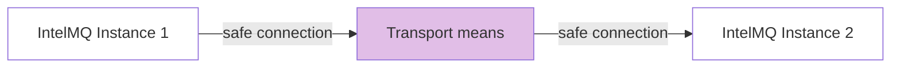

### Getting data into IntelMQ

Normally, IntelMQ requires two components to process incoming data:
- A collector bot, responsible for receiving the raw data, and
- A parser bot, responsible for parsing the data and converting it into the IntelMQ Data Format

When connecting IntelMQ instances, the parsing is not required as the received data is already in the internal format.

### Message broker

A message broker is an intermediary that accepts messages from the sender and holds them until the receiver consumes them.
It does not matter whether the broker is technically or organizationally located on the sending or receiving side.

## Security Considerations

Each data exchange method has its own security implications.
Carefully read the security considerations in each method's section for specifics.
The following points apply regardless of the method used:

- **Treat external data as untrusted**: Data arriving from other organisations may contain unexpected or malignant content. At least set the `feed.provider` and `feed.name` fields to identify its origin, so events can be traced back to the source.
- **Authentication**: Every external connection should require authentication. Anonymous access should not be permitted for inter-organisational connections.
- **Transit encryption**: Use TLS or VPNs for all connections outside of trusted internal networks.
- **Limit what each connection can do**: A recipient/sender should only be able to read/write from/to the queues or endpoints that are necessary (least-privilege principle).

## Data exchange methods

IntelMQ supports four methods for connecting instances.
The [recommendation matrix](#recommendation-matrix) below summarises when each is appropriate.

- AMQP (RabbitMQ) as broker
- Redis/Valkey as broker or message queue with mixed usage
- HTTP API (IntelMQ bots) direct connection
- TCP (IntelMQ bots) basic direct connection

### Recommendation matrix

#### By usage

|                  | Between organisations | Internal connections<br>between instances | Between related organisations<br>and departments | For data feeds           | For data hubs            |
| ---------------- | --------------------- | ----------------------------------------- | ------------------------------------------------ | ------------------------ | ------------------------ |
| **AMQP**         | ⭐⭐⭐                   | ⭐⭐⭐<br>If already in use                  | ⭐⭐⭐                                              | ⭐⭐⭐                      | ⭐⭐⭐                      |
| **Redis/Valkey** | ⭐<br>With ACLs        | ⭐⭐⭐                                       | ⭐⭐<br>With ACLs                                  | ❌️                       | ❌️                       |
| **API**          | ⭐⭐⭐                   | ⭐⭐                                        | ⭐⭐⭐                                              | ⭐⭐<br>With reverse-proxy | ⭐⭐<br>With reverse-proxy |
| **TCP**          | ❌️                    | ⭐⭐⭐                                       | ⭐                                                | ❌️                       | ❌️                       |

#### By features

|                  | Ease of setup    | Security                | Authentication                  | Authorization                                 | Message persistence                        | Buffering if receiver down     | TLS support              | Monitoring                           |
| ---------------- | ---------------- | ----------------------- | ------------------------------- | --------------------------------------------- | ------------------------------------------ | ------------------------------ | ------------------------ | ------------------------------------ |
| **AMQP**         | ⭐<br>Complex     | ⭐⭐⭐⭐                    | ⭐⭐⭐⭐<br>Per-user with passwords | ⭐⭐⭐⭐<br>Per-vhost, per-queue                  | ⭐⭐⭐⭐<br>Durable queues                     | ⭐⭐⭐⭐<br>Queues buffer messages | ⭐⭐⭐⭐<br>Built-in         | ⭐⭐⭐⭐<br>Management UI + API          |
| **Redis/Valkey** | ⭐⭐<br>Medium     | ⭐⭐⭐                     | ⭐⭐⭐<br>`requirepass` or ACLs    | ⭐⭐⭐<br>ACLs (on key and command level)        | ⭐⭐<br>Optional (RDB/AOF)                   | ⭐⭐⭐⭐<br>Lists buffer messages  | ⭐⭐⭐⭐<br>Built-in         | ⭐⭐<br>`INFO` command, external tools |
| **API**          | ⭐⭐⭐<br>Low       | ⭐⭐<br>Via reverse proxy | ⭐⭐<br>Token via reverse proxy   | ⭐⭐<br>IP allowlist via reverse proxy/firewall | ⭐⭐<br>Reception: no<br>Sending: by IntelMQ | ⭐<br>Fails immediately         | ⭐⭐⭐<br>Via reverse proxy | ⭐⭐<br>Depends on reverse proxy       |
| **TCP**          | ⭐⭐⭐⭐<br>Very low | —<br>None<br>           | —<br>None                       | —<br>None                                     | —<br>Reception: no<br>Sending: by IntelMQ  | ⭐<br>Fails immediately         | —<br>None                | —<br>None                            |

### AMQP

This is the most sophisticated option and gives the best security, data flow control, and stability.
The downside is that it is a bit more complex to set up.

The protocol is called AMQP (Advanced Message Queuing Protocol) and is designed for reliable, asynchronous message passing between systems.
It supports features such as message acknowledgement, encryption and flexible routing via exchanges and routing keys.

The broker software used here is [**RabbitMQ**](https://www.rabbitmq.com/).
It acts as a central hub that receives messages from senders and delivers them to receivers.
RabbitMQ handles queuing, routing, and persistence, so messages are not lost when the receiving side is temporarily unavailable.

There are two common deployment patterns:

**Multiple organisations, each with their own broker**: each organisation runs its own RabbitMQ instance.
A sender bot on one side publishes to the remote broker of the receiving organisation, which an AMQP collector bot on that side consumes from.

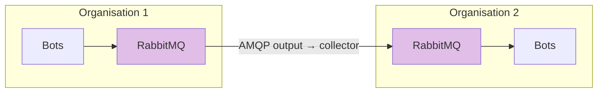

**One organisation, multiple instances, one shared broker**: all IntelMQ instances connect to a single central RabbitMQ broker.
Bots on any instance can publish to or consume from shared queues without needing direct instance-to-instance connectivity.

**Two organisations – pull method:**

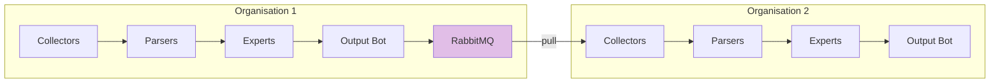

**Two organisations – push method:**

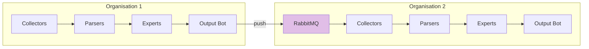

#### Differentiation to using AMQP as message broker

AMQP can be used in two distinct roles within IntelMQ.

Internally, AMQP it can replace Redis as the message broker between bots within a single IntelMQ instance.
See [Using the AMQP broker](../beta-features.md#using-amqp-message-broker) for that use case.

This section focuses on using AMQP to connect separate IntelMQ instances to each other, either within the same organisation or across organisational boundaries.

It is not necessary to use AMQP as internal message broker when using AMQP for external connections.
A mix of of Redis and AMQP is perfectly possible and useful.

#### Security considerations

- **Use TLS**: Always encrypt data in transit between organisations and in insecure networks. Set `use_ssl: true` on either side and configure RabbitMQ to listen on the TLS port.
- **Authentication**: always configure a dedicated RabbitMQ user with a strong password for each remote connection. Never use the default `guest` account.
- **Virtual hosts**: use separate RabbitMQ virtual hosts (`connection_vhost`) to isolate traffic between different organisations or pipelines.
- **Least-privilege permissions**: Grant each broker user only the permissions needed: read access on the queue for collectors, write access on the exchange for output bots.
- **Network exposure**: avoid exposing RabbitMQ directly to the internet. Prefer placing it behind a firewall and only opening the AMQP(S) port to known IP ranges. A VPN or dedicated interconnect between organisations is strongly recommended. If RabbitMQ needs to be exposed to the Internet, always configure strong transport encryption and authentication.
- **Resource exhaustion**: Without limits, a stalled consumer can exhaust the broker's memory and disk space. Configure queue length limits and message TTLs to prevent a slow or unresponsive receiver from causing unbounded queue growth.
- **Monitoring**: Integrate RabbitMQ into your existing monitoring systems to detect any problems or warning signs.

#### Prerequisites

Install the Python Library `pika` for AMQP on the servers that access the RabbitMQ instance:
``` bash
# Debian/Ubuntu
sudo apt install python3-pika
```

#### On the receiver (pull-method)

If the broker is in the sender's organisation, then the receiver configures an AMQP collector, fetching the data from the data provider.

##### Collector

Module: `intelmq.bots.collectors.amqp.collector_amqp`

###### Parameters

These configuration parameters are required:

- `connection_host`: Hostname of the AMQP server.
- `connection_port` Port of the AMQP server. Defaults to 5672.
- `connection_vhost`: Virtual host to connect, on an HTTP(S) connection would be `<http:/IP/><your virtual host>`.
- `expect_intelmq_message`: `true`. This parameter denotes whether the data is from IntelMQ or not. If true, then the data can be any Report or Event and will be passed to the next bot as is. Otherwise a new Report is created with the raw data. Defaults to false.
* `queue_name`: (optional, string) The name of the queue to fetch the data from.
* `username`: Optional username for authentication to the AMQP server.
* `password`: Optional Password
* `use_ssl`: Use of TLS for the connection. Make sure to also set the correct port. Defaults to false.

A full description and all parameters of the bot are in the [AMQP collector's documentation](../../user/bots.md#intelmq.bots.collectors.amqp.collector_amqp).

##### Parser

No parser is needed.

When configuring this via the IntelMQ Manager, it will notify you that the parser is missing.
In this case, you can ignore this message.

#### On the sender (push method)

If the broker is in the recipient's organisation, then the sender configures an AMQP output, pushing the data to the data recipient.

##### Output

Module: `intelmq.bots.outputs.amqptopic.output`

###### Parameters

AMQP Connection:

- `connection_host`:  Hostname of the AMQP server
- `connection_port`: Port of the AMQP server. Defaults to 5672.
- `connection_vhost`:  (optional, string) Virtual host to connect, on an http(s) connection would be `http://IP/<your virtual host>`
- `use_ssl`:  Set to `true` to use SSL/TLS. Also adapt the connection port
- `delivery_mode`: `2`  for persistent delivery
- `require_confirmation`: `true` to guarantee delivery

AMQP Routing:

- `exchange_durable`: `true` to make the exchange survive server restarts
- `exchange_name`:  Optional name of the exchange
- `exchange_type`: `topic`
- `routing_key`: The routing key for the AMQP Topic

Authentication:

- `username`:  Optional username for authentication
- `password`:  Optional password for authentication

Message settings:

- `keep_raw_field`: `true` to keep the data original
* `message_hierarchical_output`: `false` (the default value)
* `message_with_type`: `true`
* `message_jsondict_as_string`: `true`

A full description and all parameters of the bot are in the [AMQP output's documentation](../../user/bots.md#intelmq.bots.outputs.amqptopic.output).

### Valkey / Redis

Valkey/Redis are used as default messaging broker internally by IntelMQ for the communication between the bots.
It's fast and trivial to setup for internal usage, and can also be used as a very simple connection between internal, highly trusted instances.

Redis is the original open-source in-memory data store that IntelMQ has historically used as its internal message broker.
Valkey is a community-maintained fork of Redis created in 2024 after Redis changed its license.
Valkey is a drop-in replacement: IntelMQ supports both, and the configuration is identical.
Valkey is the recommended choice for new deployments on distributions that package it (e.g. Debian 13 trixie and newer).

#### Multiple instances using the same messaging broker

To expose a Redis/Valkey instance to a another IntelMQ instance, the simplest approach is to bind it to a non-loopback interface and open the port in the firewall.
The receiving side then points its `source_queues` directly at the remote host.

!!! warning
    Sharing the internal message broker between instances removes isolation between them.
    Use this only for highly trusted instances on the same private network.
    For any cross-organisational connection, use a separate dedicated broker instead.


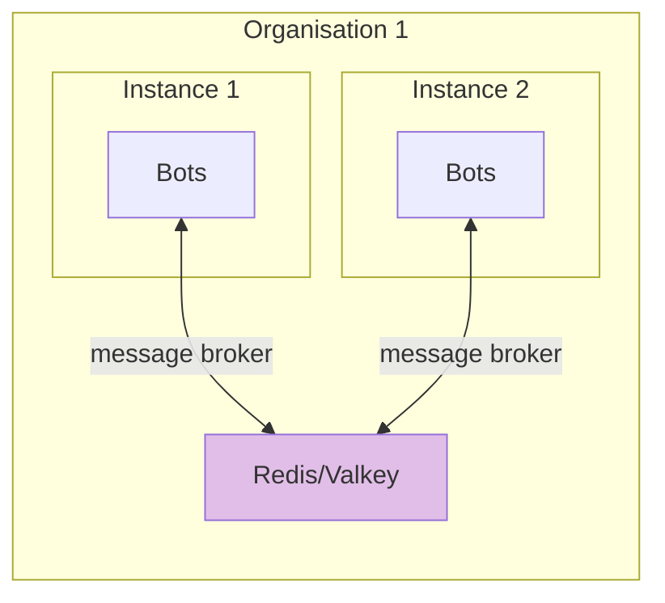

#### Separate Redis/Valkey instance

Rather than exposing the internal message broker, a dedicated Redis/Valkey instance can be set up solely for inter-instance communication.
This keeps the internal queue isolated from external access and limits the capabilities if the shared broker is compromised or overloaded.

The sender side writes to a queue on the shared broker, the receiver side reads from it, mirroring the pull method used with AMQP.

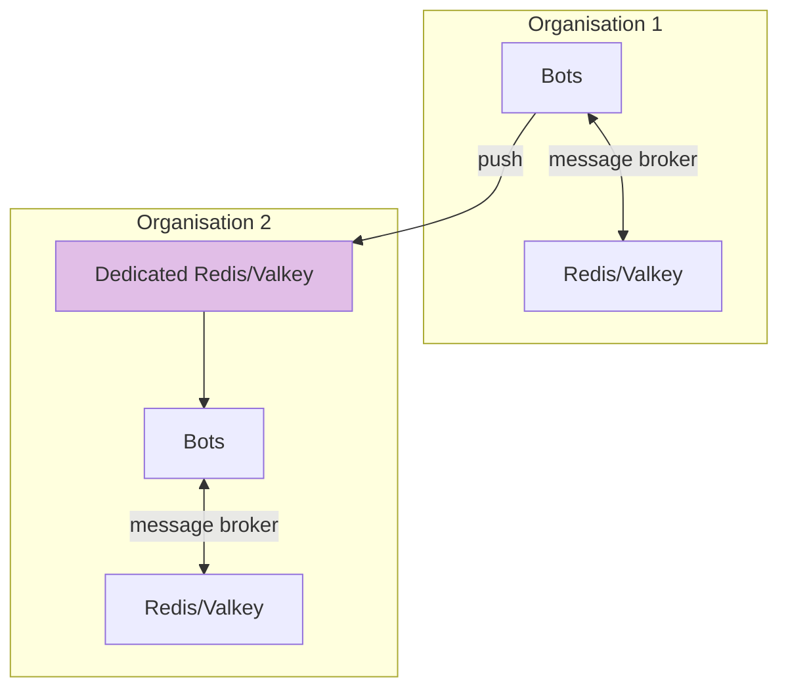

#### Security considerations

- **Authentication**: Use at least the simple `requirepass` directive or, preferably, ACL-based authentication (see below) to prevent unauthenticated access. Never expose a password-free instance outside localhost. See [Redis authentication documentation](https://redis.io/docs/latest/operate/oss_and_stack/management/security/#authentication).
- **ACLs**: Redis and Valkey both support Access Control Lists, allowing fine-grained per-user permissions. Create a dedicated user for each remote connection and restrict it to only the commands and key patterns it needs. In `valkey.conf` or `redis.conf`:

    ```
    # Sender side: allow only writing to a specific queue for a specific user with a given password
    ACL SETUSER intelmq-sender on >yourpassword ~intelmq-queue -@all +LPUSH

    # Receiver side: allow only reading
    ACL SETUSER intelmq-receiver on >yourpassword ~intelmq-queue -@all +BRPOP
    ```

    Alternatively, manage ACLs in a separate file via the `aclfile` directive and apply changes at runtime with `ACL LOAD`. See the [Valkey ACL documentation](https://valkey.io/topics/acl/) and the [Redis ACL documentation](https://redis.io/docs/latest/operate/oss_and_stack/management/security/acl/).
- **Network exposure**: Bind Redis/Valkey to a specific interface rather than the default `0.0.0.0`. Restrict access to the port via firewall rules, allowing only the IP addresses of known IntelMQ instances.
- **TLS**: Both Redis and Valkey support TLS to encrypt data in transit. Enable it via the `tls-port`, `tls-cert-file`, `tls-key-file`, and `tls-ca-cert-file` directives in the server configuration. See the [Valkey TLS documentation](https://valkey.io/topics/tls/) and the [Redis TLS documentation](https://redis.io/docs/latest/operate/oss_and_stack/management/security/encryption/) for details.
- **Protected mode**: Redis and Valkey ship with protected mode enabled by default, which blocks external connections unless authentication is configured. Do not disable protected mode without putting other controls in place.

#### On the sender

##### Output

Module: `intelmq.bots.outputs.redis.output`

###### Parameters

- `redis_server_ip`: Hostname of the remote Redis server
- `redis_server_port`: Port of the Redis server. Defaults to 6379.
- `redis_db`: Redis database number. Defaults to 2.
- `redis_password`: Redis server password. Defaults to null.
- `redis_queue`: Redis queue name, such as `remote-server-queue`
- `redis_timeout`: Connection timeout, in milliseconds. Defaults to 5000.
- `hierarchical_output`: Set to `false`, the default value. Split field names by a dot.
- `with_type`: Set to `true`, the default value. Whether to include `__type` field.

### API bots

IntelMQ provides HTTP-based bots for sending and receiving events over a simple REST-like interface.
The receiver side runs a lightweight HTTP server (the API collector bot) and the sender side posts events to it using the REST API output bot.

This method works well across network boundaries where AMQP or Redis ports are not permitted.
It is a push-only, unidirectional connection.

A reverse proxy (e.g. nginx or Apache) in front of the API collector is recommended for production deployments, to handle TLS, rate limiting, and authentication.

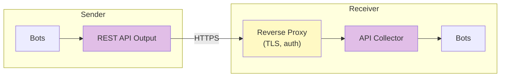

A popular example for the API method in a data feed distribution is the Feed [Have I Been Pwned](../..//user/feeds.md#have-i-been-pwned).
The feed documentation includes an **example nginx configuration** for reverse proxying including TLS offloading and authentication.

#### Security considerations

- **TLS**: Always serve the API collector behind HTTPS.
- **Authentication**: The REST API output bot supports token-based authentication via `auth_type` and `auth_token`. Configure the reverse proxy to require this token, so unauthenticated requests are rejected before reaching the collector.
- **Network exposure**: Expose only the HTTPS port. Do not expose the collector's internal port (default: 5000) directly to the internet
- **Network whitelisting**: Restrict access by IP allowlist at the reverse proxy or firewall.

#### On the receiver

##### Prerequisites

Install the HTTP server library `tornado` (4.5.3 or later) on the receiver:
``` bash
# Debian/Ubuntu
sudo apt install python3-tornado
```

##### Collector

This bot starts a minimalist HTTP server and processes all messages that are received under the `/intelmq/push` path.

Module: `intelmq.bots.outputs.api.collector`

###### Parameters

- `port`: The port to listen on. Default: 5000
- All parameters related to UNIX sockets are not used for inter-machine communication

A full description and all parameters of the bot are in the [API collector's documentation](../../user/bots.md#intelmq.bots.collectors.api.collector).

##### Parser

No parser is needed.

When configuring this via the IntelMQ Manager, it will notify you that the parser is missing.
In this case, you can ignore this message.

#### On the sender

##### Output

Module: `intelmq.bots.outputs.restapi.output`

###### Parameters

- `host`: The full URL, e.g. `https://intelmq.example.com:4433/intelmq/push`
- `auth_type`, `auth_token` and `auth_token_name`: Optional if there is an additional reverse proxy with authentication in between
- `hierarchical_output`: `false` (the default value)
- `use_json`: `true` (the default value)

A full description and all parameters of the bot are in the [API output's documentation](../../user/bots.md#intelmq.bots.outputs.restapi.output).

### TCP bots

TCP is the simplest connection method: the sender opens a direct TCP connection to the receiver and pushes events one by one, waiting for a plain "Ok" acknowledgement after each message.

There is no broker, no queuing and no built-in security.

Use this method only for simple, trusted internal connections where simplicity more than reliability or security.

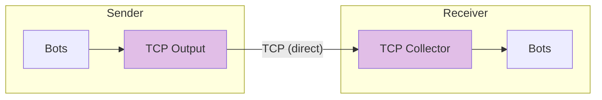

#### Security considerations

- **No authentication and authorization**: There is no support for user authentication and authorization. No permission management.
- **No encryption**: Data is transmitted in plain text. Use and VPNs to protect the traffic.
- **Network exposure**: Never expose the TCP collector port to the internet. Restrict it to known sender IP addresses via firewall rules.

#### On the receiver

##### Collector

Module: `intelmq.bots.collectors.tcp.collector`

###### Parameters

- `ip`: IP address to listen on.
- `port`: Port to listen on.

A full description and all parameters of the bot are in the [TCP collector's documentation](../../user/bots.md#intelmq.bots.collectors.tcp.collector).

##### Parser

No parser is needed.

When configuring this via the IntelMQ Manager, it will notify you that the parser is missing.
In this case, you can ignore this message.

#### On the sender

##### Output

Module: `intelmq.bots.outputs.tcp.output`

###### Parameters

- `ip`: Hostname of the TCP collector.
- `port`: Port of the TCP collector.
- `counterpart_is_intelmq`: Set to `true` (the default) when connecting to an IntelMQ TCP collector. The output bot will then wait for the "Ok" acknowledgement after each message.
- `hierarchical_output`: `false` (the default value).

A full description and all parameters of the bot are in the [TCP output's documentation](../../user/bots.md#intelmq.bots.outputs.tcp.output).
