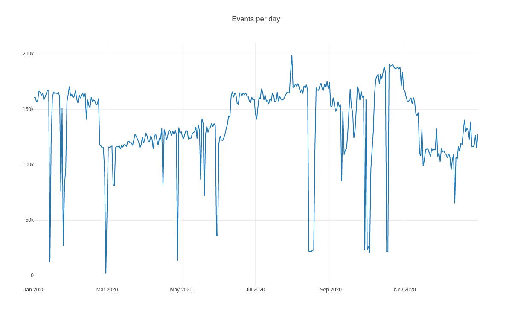

<!-- comment
   SPDX-FileCopyrightText: 2015-2023 Sebastian Wagner, Birger Schacht, Filip Pokorný
   SPDX-License-Identifier: AGPL-3.0-or-later
-->

# Using PostgreSQL as a database for IntelMQ

The EventDB is a database (usually [PostgreSQL](https://postgresql.org/)) that
gets filled with with data from IntelMQ using the SQL Output
Bot.

## intelmq_psql_initdb

IntelMQ comes with the `intelmq_psql_initdb` command line tool designed to help with creating the
EventDB. It creates in the first line:

- A `CREATE TABLE events` statement with all valid IntelMQ fields as columns and correct types
- Several indexes as examples for a good read & search performance

Having an `events` table as outlined in the SQL file, IntelMQ's SQL Output Bot can write all received events into this database table.

In addition, the script supports some additional features supporting use cases described later in this document:

- `--partition-key` - for generating schema aligned with TimescaleDB or partitioned tables,
- `--separate-raws` - for generating views and triggers needed to `eventdb_raws_table` (works also together with adjustments for partitioning).

For a full list of supported parameters, call the script help using `-h` parameter.

All elements of the generated SQL file can be adapted and extended before running the SQL file against a database, especially the indexes. Please review the generated script before applying.

Be aware that if you create tables using another DB user that is used later by the output bot, you may need to adjust ownership or privileges in the database. If you have problems with database permissions,
refer to `PostgreSQL documentation <https://www.postgresql.org/docs/current/ddl-priv.html>`.

## EventDB Utilities

Some scripts related to the EventDB are located in the
[contrib/eventdb](https://github.com/certtools/intelmq/tree/develop/contrib/eventdb)
folder in the IntelMQ git repository.

### Apply Malware Name Mapping

The `apply_mapping_eventdb.py` script applies the malware
name mapping to the EventDB. Source and destination columns can be
given, also a local file. If no local file is present, the mapping can
be downloaded on demand. It queries the database for all distinct
malware names with the taxonomy "malicious-code" and sets another
column to the malware family name.

### Apply Domain Suffix

The `apply_domain_suffix.py` script writes the public
domain suffix to the `source.domain_suffix` /
`destination.domain_suffix` columns, extracted from
`source.fqdn` / `destination.fqdn`.

#### Usage

The Python scripts can connect to a PostgreSQL server with an
`eventdb` database and an `events` table. The
command line arguments interface for both scripts are the same. See
`--help` for more information:

```bash
apply_mapping_eventdb.py -h
apply_domain_suffix.py -h
```

### PostgreSQL trigger

PostgreSQL trigger is a trigger keeping track of the oldest
inserted/updated "time.source" data. This can be useful to
(re-)generate statistics or aggregation data.

The SQL script can be executed in the database directly.

## EventDB Statistics

The EventDB provides a great base for statistical analysis of the data.

The [eventdb-stats
repository](https://github.com/wagner-certat/eventdb-stats) contains a
Python script that generates an HTML file and includes the [Plotly
JavaScript Open Source Graphing
Library](https://plotly.com/javascript/). By modifying the configuration
file it is possible to configure various queries that are then displayed
using graphs:



## Using EventDB with Timescale DB

[Timescale DB](https://www.timescale.com/) is a PostgreSQL extension to
add time-series support, which is quite handy as you don't have to learn
other syntaxes as you already know. You can use the SQL Queries as
before, the extension will handle the rest. To see all limitations,
please check the [Timescale DB
Documentation](https://docs.timescale.com/timescaledb/latest/).

### What is time-series?

Time-series has been invented as traditional database design like
relational or nosql are not made for time-based data. A big benefit of
time-series instead of other database designs over a time-based search
pattern is the performance. As IntelMQ uses data based upon time, this
design is awesome & will give you a performance boost.

### How to choose the time column?

To utilize the time-series, choose a column containing the right time. This is then
used by you for manual queries and graphs, and also by the database itself for organizing the data.

An Event has two fields that can be used for this:
`time.source` or `time.observation`. Depending on your needs (tracking when the event occurred or when it was detected, if different), choose one of them.

You can use the :ref:`intelmq_psql_initdb` tool to generate SQL schema valid for TimescaleDB by passing the partitioning key:

```
intelmq_psql_initdb --partition-key "time.source"
```

### How to setup

Thanks to TimescaleDB its very easy to setup.

1. Choose your preferred
[Timescale
DB](https://docs.timescale.com/timescaledb/latest/how-to-guides/install-timescaledb/self-hosted/)
environment & follow the installation instructions. 2. Now lets create a
[hypertable](https://docs.timescale.com/api/latest/hypertable/create_hypertable/),
which is the timescale DB time-series structure.
`SELECT create_hypertable('', 'time.source');`. 3. Now our hypertable is
setup & timescaleDB takes care of the rest. You can perform queries as
usual, for further information please check [Timescale DB
Documentation](https://docs.timescale.com/timescaledb/latest/).

### How to upgrade from my existing database?

To update your existing database to use this awesome time-series
feature, just follow the `How to setup` instruction. You can perform the
`hypertable` command even on already existing databases. **BUT** there
are [some limitations](https://docs.timescale.com/timescaledb/latest/overview/limitations/)
from timescaleDB.

## Separating raw values in PostgreSQL using view and trigger

In order to reduce the row size in the events table, the
`raw` column's data can be separated from the other
columns. While the raw-data is about 30-50% of the data row's size, it
is not used in most database queries, as it serves only a backup
functionality. Other possibilities to reduce or getting rid of this
field are described in the FAQ, section
`faq-remove-raw-data`.

The steps described here are best performed before the
`events` table is filled with data, but can as well be done
with existing data.

The approach requires four steps:

1.  An existing `events` table, see the first section of
    this document.
2.  Deleting or renaming the `raw` column of the
    `events` table.
3.  Creating a table `raws` which holds only the
    `raw` field of the events and linking both tables using
    the `event_id`.
4.  Creating the view `v_events` which joins the tables
    `events` and `raws`.
5.  Creating the function `process_v_events_insert` and
    `INSERT` trigger `tr_events`.

The last steps brings us several advantages:

-   All `INSERT` statements can contain all data, including
    the `raw` field.
-   No code changes are needed in the IntelMQ output bot or your own
    scripts. A migration is seamless.
-   PostgreSQL itself ensures that the data of both tables is consistent
    and linked correctly.

The complete SQL script can be generated using the `intelmq_psql_initdb`. It does *not* cover step 2 to avoid accidental
data loss - you need to do this step manually.


### Other docs

You have two basic choices to run PostgreSQL:

1. on the same machine as intelmq, then you could use Unix sockets if available on your platform
2. on a different machine. In which case you would need to use a TCP connection and make sure you give the right
   connection parameters to each psql or client call.

Make sure to consult your PostgreSQL documentation about how to allow network connections and authentication in case 2.

**PostgreSQL Version**

Any supported version of PostgreSQL should work (v>=9.2 as of Oct 2016) [[1]](https://www.postgresql.org/support/versioning/).

If you use PostgreSQL server v >= 9.4, it gives you the possibility to use the time-zone [formatting string](https://www.postgresql.org/docs/9.4/static/images/functions-formatting.html) "OF" for date-times and the [GiST index for the CIDR type](https://www.postgresql.org/docs/9.4/static/images/release-9-4.html#AEN120769). This may be useful depending on how you plan to use the events that this bot writes into the database.

**How to install**

Use `intelmq_psql_initdb` to create initial SQL statements from `harmonization.conf`. The script will create the
required table layout and save it as `/tmp/initdb.sql`

You need a PostgreSQL database-user to own the result database. The recommendation is to use the name `intelmq`
. There may already be such a user for the PostgreSQL database-cluster to be used by other bots. (For example from
setting up the expert/certbund_contact bot.)

Therefore if still necessary: create the database-user as postgresql superuser, which usually is done via the system
user `postgres`:

```bash
createuser --no-superuser --no-createrole --no-createdb --encrypted --pwprompt intelmq
```

Create the new database:

```bash
createdb --encoding='utf-8' --owner=intelmq intelmq-events
```

(The encoding parameter should ensure the right encoding on platform where this is not the default.)

Now initialize it as database-user `intelmq` (in this example a network connection to localhost is used, so you would
get to test if the user `intelmq` can authenticate):

```bash
psql -h localhost intelmq-events intelmq </tmp/initdb.sql
```

**PostgreSQL and null characters**

While null characters (`0`, not SQL "NULL") in TEXT and JSON/JSONB fields are valid, data containing null characters can
cause troubles in some combinations of clients, servers and each settings. To prevent unhandled errors and data which
can't be inserted into the database, all null characters are escaped (`u0000`) before insertion.