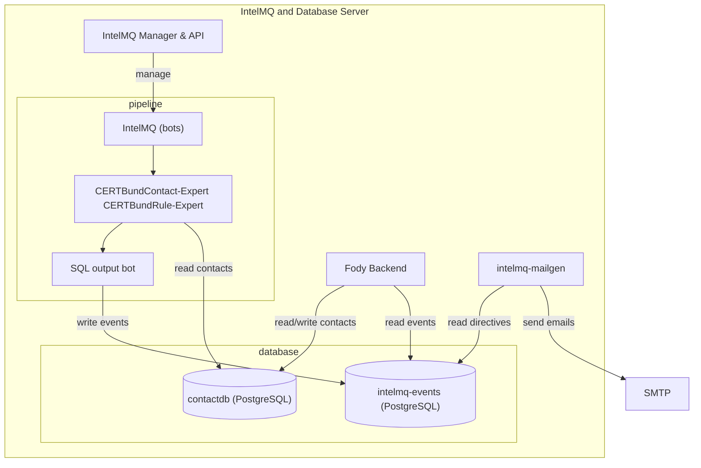
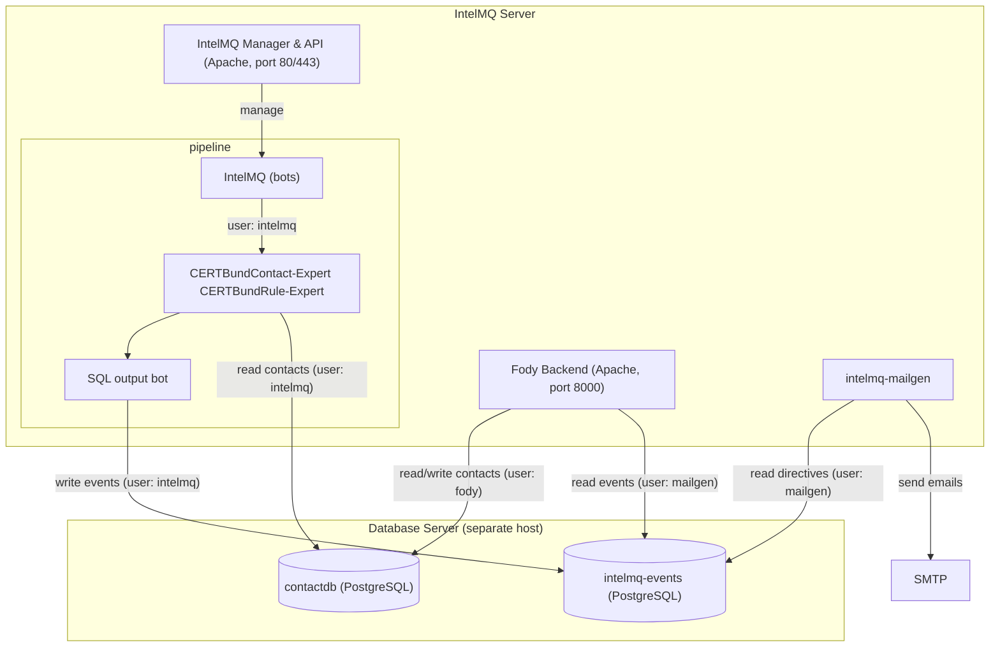

<!-- comment
   SPDX-FileCopyrightText: 2026 Institute for Common Good Technology
   SPDX-License-Identifier: AGPL-3.0-or-later
-->

This guide covers installing the full IntelMQ tool suite on Ubuntu 24.04:

- **IntelMQ**: the core pipeline that processes the data
- **IntelMQ Manager**: web UI for managing and monitoring the pipeline
- **Fody**: web UI for managing contacts and viewing notifications (tickets)
- **IntelMQ CERTBund Contact**: enriches events with contact data from a contact database and includes the RIPE import
- **IntelMQ Mailgen**: notification tool to send emails to constituents

In the future it will also include:

- **IntelMQ Webinput**: web UI to interactively process uploaded data files and send it to constituents

The setup can be deployed on a **single server** (application and database co-located) or split across **two servers** (dedicated database host). Both variants are described below.

!!! warning
    Never expose any interface of IntelMQ services to untrusted networks. IntelMQ is meant to be operated only in internal networks by internal operators.

!!! note
    HTTPS is not configured automatically. See [mod_md](https://httpd.apache.org/docs/2.4/mod/mod_md.html) for a straightforward way to provision TLS certificates via Apache.

### Single-server setup



### Two-server setup



### Ansible

For automated orchestration, an ansible role is available: [`ansible-galaxy role install sebix.intelmq`](https://galaxy.ansible.com/ui/standalone/roles/sebix/intelmq/) (Source: [github.com/sebix/ansible-intelmq](https://github.com/sebix/ansible-intelmq)).
It covers all components listed here.

### Network

The webinterfaces will be reachable to you on these ports:

- `http://yourip:80/intelmq-manager`: IntelMQ Manager & API
- `http://yourip:8000/`: IntelMQ Fody

In the firewall settings, both ports need to be opened to the operator's network.

In case of the two-server layout, the PostgreSQL port (5432/tcp) on the database server needs to be reachable from the IntelMQ server.

## Application installation

1. For IntelMQ follow https://docs.intelmq.org/develop/admin/installation/linux-packages/#ubuntu-2004-2204-and-2404
2. Install some dependencies for IntelMQ bots: `sudo apt install python3-psycopg2 python3-pyasn python3-textx`
3. On the production systems: `sudo apt install intelmq-autostart moreutils`
4. On the test systems: `sudo apt install dsmtpd-intelmq mutt`

### Fody

On the IntelMQ server:

1. Run `sudo dpkg-reconfigure locales` and select `en_US.UTF-8`
2. Then reboot the server
3. `sudo apt install intelmq-certbund-contact intelmq-mailgen intelmq-fody intelmq-fody-backend`
4. Install the PostgreSQL client library: `sudo apt install postgresql-client-16`
5. To use the same authentication in IntelMQ Fody as IntelMQ Manager:
	1. From `/etc/intelmq/api-config.json` copy the value of the field `session_store` (likely `/var/lib/dbconfig-common/sqlite3/intelmq-api/intelmqapi`)
		1. Programmatically: `jq -r .session_store /etc/intelmq/api-config.json`
	2. In `/etc/intelmq/fody-session.conf` set this value at `session_store`.
	3. `sudo systemctl restart apache2`

## Database installation and setup

These instructions are partially based on and compatible with https://docs.intelmq.org/latest/admin/database/postgresql/#Setup

1. On the database server install PostgreSQL and configure it for connections from the application server:
	1. `sudo apt install postgresql-16` Or, alternatively, use the APT repository by the PostgreSQL team: https://www.postgresql.org/download/linux/ubuntu/
	2. If the database server is separate from the IntelMQ-server:
		1. In `/etc/postgresql/16/main/postgresql.conf` adapt the `listen_address` and set the public interface of the server
		2. In `/etc/postgresql/16/main/pg_hba.conf` add these lines replacing `$intelmqserver` with the IP address of the IntelMQ server accessing the Database server
			1. `host intelmq-events intelmq $intelmqserver/32 scram-sha-256`
			2. `host intelmq-events mailgen $intelmqserver/32 scram-sha-256`
			3. `host contactdb intelmq $intelmqserver/32 scram-sha-256`
			4. `host contactdb fody $intelmqserver/32 scram-sha-256`
		3. `sudo systemctl restart postgresql`
2. Create PostgreSQL roles and database:
	1. `sudo -u postgres createuser --no-superuser --no-createrole --no-createdb --encrypted --pwprompt intelmq`
		1. Set and remember the password
	2. `sudo -u postgres createuser --no-superuser --no-createrole --no-createdb --encrypted --pwprompt fody`
		1. Set and remember the password
	3. `sudo -u postgres createuser --no-superuser --no-createrole --no-createdb --encrypted --pwprompt mailgen`
		1. Set and remember the password
	4. `sudo -u postgres createuser --no-superuser --no-createrole --no-createdb contactdb_owner`
	5. `sudo -u postgres createdb --encoding='utf-8' --owner=intelmq intelmq-events --template template0`
	6. `sudo -u postgres createdb --encoding=UTF8 --template=template0 --owner=contactdb_owner contactdb`
3. To initialize the event database:
	1. Either:
		1. Run `intelmq_psql_initdb` on the IntelMQ server
			1. It creates an SQL-file, normally called `/tmp/initdb.sql`
		2. Copy the file to the database server with `scp` either on the server or via the client, depending on the ssh/network setup to a location where postgres can read it, e.g. `/tmp/`
	2. Or, if copying the file from server to server is not doable:
		1. Download the file on the database server from GitHub:
		2. `wget https://raw.githubusercontent.com/certtools/intelmq/refs/heads/3.3.1/intelmq/tests/bin/initdb.sql`
	3. Create the table `events` with: `sudo -u postgres psql intelmq-events < /tmp/initdb.sql`
	4. Remove the file: `sudo rm /tmp/initdb.sql`
4. To initialize the contact database:
	1. Either
		1. Copy `/usr/share/intelmq-certbund-contact/sql/initdb.sql` from the IntelMQ server to the database server to a location where postgres can read it, e.g. `/tmp/`
	2. Or
		1. download it on the database server from GitHub:
		2. `wget https://raw.githubusercontent.com/Intevation/intelmq-certbund-contact/refs/tags/1.1.0/sql/initdb.sql -O /tmp/initdb.sql`
	3. Create the tables with `sudo -u postgres psql -f /tmp/initdb.sql contactdb`
	4. Remove the file: `rm /tmp/initdb.sql`
	5. Create the roles and grant permissions:
		1. `sudo -u postgres psql contactdb`
		2. `CREATE ROLE contactdb_ro NOLOGIN NOSUPERUSER NOINHERIT NOCREATEDB CREATEROLE;`
		3. `CREATE ROLE contactdb_rw NOLOGIN NOSUPERUSER NOINHERIT NOCREATEDB CREATEROLE;`
		4. `GRANT SELECT, INSERT, UPDATE, DELETE ON ALL TABLES IN SCHEMA public TO contactdb_rw;`
		5. `GRANT USAGE ON ALL SEQUENCES IN SCHEMA public TO contactdb_rw;`
		6. `GRANT SELECT ON ALL TABLES IN SCHEMA public TO contactdb_ro;`
		7. `GRANT contactdb_ro TO intelmq;`
		8. `GRANT contactdb_rw TO fody;`
5. To setup notifications tables:
	1. 1. Either
		1. Copy `/usr/share/intelmq-mailgen/sql/notifications.sql` from the IntelMQ server to the database server to a location where postgres can read it, e.g. `/tmp/`
	2. Or
		1. download it on the database server from GitHub:
		2. `wget https://raw.githubusercontent.com/Intevation/intelmq-mailgen/refs/tags/1.3.7/sql/notifications.sql -O /tmp/notifications.sql`
	3. Create the tables with `sudo -u postgres psql -f /tmp/notifications.sql intelmq-events`
	4. Remove the file: `rm /tmp/notifications.sql`
	5. Grant permissions:
		1. `sudo -u postgres psql -c "GRANT eventdb_insert TO intelmq;" intelmq-events`
		2. `sudo -u postgres psql -c "GRANT eventdb_send_notifications TO mailgen;" intelmq-events`

## Fody configuration

1. Optionally create email tags for Fody: https://github.com/Intevation/intelmq-certbund-contact/?tab=readme-ov-file#adding-default-email-tags
2. Backend configuration:
	1. In `/etc/intelmq/contactdb-serve.conf` set the database server host, user `fody` and its password
	2. In `/etc/intelmq/eventdb-serve.conf` set the database server host, user `mailgen` and its password
	3. In `/etc/intelmq/tickets-serve.conf` set the database server host, user `mailgen` and its password
3. Optionally add predefined tags (for network objects and organisations) in `/etc/intelmq/contactdb-serve.conf`:
  ```
  {
    "common_tags": [ "Whitelist:Malware",
                   "Whitelist:DNS-Open-Resolver",
                   "Whitelist:Shadowserver",
                   "Whitelist:All",
                   ],
   ...
   }
  ```
4. `sudo systemctl restart apache2.service`
5. The login should work now
	1. If not, have a look at `/var/log/apache2/fody-backend-error.log`
6. Add the CERTBund bots to the runtime configuration:
	1. Open the webinterface IntelMQ Manager `http://intelmq.example/intelmq-manager`
	2. Log in
	3. Go to page *Configuration*
	4. Insert these two bots right before your Output Bot:
		1. CERTBundContact-Expert
			1. In its configuration, set the database server, database user `intelmq` and its password
		2. CERTBundRule-Expert
	5. Save the new configuration

### RIPE Data

1. Create the configuration file
	1. `/etc/intelmq/contactdb-import.conf` and insert the country code you are interested in (here, as example `AT`):
	   ```json
	   {
		   "restrict_to_country": ["AT"]
	   }
	   ```
2. Import RIPE data the first time
	1. https://github.com/Intevation/intelmq-certbund-contact/blob/master/README-ripe-import.md
	2. `ripe_download`
	3. change to the created directory (named the current date)
	4. `ripe_import`
3. Configure the automatic update
	1.  Add a cronjob, e.g. every Monday evening in `/etc/crontab`:
		1. `40 17 * * * intelmq /usr/local/bin/ripe_update.sh`
	2. If the mail setup of the server is correct, an email with the differences will be sent to the administrator

## Mailgen

### Configuration

1. `mv /etc/intelmq/intelmq-mailgen.conf.example /etc/intelmq/intelmq-mailgen.conf`
2. In `/etc/intelmq/intelmq-mailgen.conf` set the database host, user `mailgen` and its password

### Test-System: Capture E-Mails

- On the test server: `sudo apt install dsmtpd-intelmq mutt`
- To read the e-mails use this command: `sudo mutt -Rf /var/lib/dsmtpd/Maildir`
- on the test server, in `/etc/intelmq/intelmq-mailgen.conf`, set the SMTP server to `localhost:1025` like this:
  ```
    "smtp": {
        "host": "127.0.0.1",
        "port": 1025
    }
  ```

### Templates and Scripts

- The documentation is at https://intevation.github.io/intelmq-mailgen/
- Configure your notification rule scripts in `/var/lib/intelmq/bots/notification_rules/` on the server
	- The example rule scripts are located in `/usr/share/doc/intelmq-certbund-contact/example-rules/`
	- A good starting minimal point are these rule scripts
		- `05_meta.py`
		- `06_whitelist.py`
		- `08_remove_invalid.py`
		- `10_prioritize_contacts.py`
		- `15_demo.py`
	- Delete any unneeded files in that directory
- Eventually delete old unsent directives if there are any from previous runs, so the current scripts can process all unprocessed directives:
	- `psql intelmq-events intelmq_mailgen` (or use the respective user instead of `intelmq_mailgen`)
	- `DELETE FROM directives WHERE sent_id IS NULL;`
- then restart the rules expert: `intelmqctl restart contact-rule-expert
- Configure your mailgen format scripts in `/etc/intelmq/mailgen/format` on the server
	- A good starting point are these format scripts:
		- `00_add_variables_to_context.py`
		- `20_demo.py`
	- Delete any unneeded files in that directory
- Configure the mailgen templates from in `/etc/intelmq/mailgen/templates`on the sever:
	- Examples templates are located in `/usr/share/doc/intelmq-mailgen/templates/`
	- The template `demo` is required for the demo rules and formats previously configured.
- The mailgen configuration is located in `/etc/intelmq/intelmq-mailgen.conf`
	- In a two-server scenario, add the database server hostname or IP address.
- Make simulation runs: `intelmqcbmail -n`
	- To actually send emails, without `-n`
	- Get more informative output (verbose mode) with `-v`
	- To view the emails, use `sudo mutt -Rf /var/lib/dsmtpd/Maildir`

## Permission overview

### UNIX users

- **intelmq**: unprivileged user that runs all IntelMQ Bots,
  the IntelMQ API and the command line tools including `intelmqcbmail`
  usually only exists on the server running IntelMQ, not a dedicated database server (if separated), unless `intelmqcbmail` is run on the database server

### IntelMQ Webinterface users

Both the IntelMQ Manager (actually: the IntelMQ API) and Fody have a basic access control with username/password.
The backends use an SQLite file-database for user- and session management.
The applications can use different databases (default) or the same one.

The Manager's database is defined in `/etc/intelmq/api-config.json`, and for Fody it is in `/etc/intelmq/fody-session.conf`.
The key `session_store` defines the path to the database file.
They can be set to the same value, then the user database is equal for both applications.

#### Create users

```
sudo fody-adduser --user username
# enter password on stdin
```

#### Delete users

```
sudo sqlite3 $(jq -r .session_store /etc/intelmq/fody-session.conf)
.headers on
# list users:
SELECT * FROM user;
# delete a user
DELETE FROM user WHERE username = 'username_to_delete';
```

### PostgreSQL

The PostgreSQL users are independent of UNIX users[^1]

#### Change users

```
sudo -u postgres psql
# Create new user:
CREATE USER username NOSUPERUSER NOCREATEROLE NOCREATEDB ENCRYPTED PASSWORD 'password';
# Show all users:
\dg
# Change password of user
ALTER USER username WITH PASSWORD 'new_password';
# Rename a user
ALTER USER old_username RENAME TO new_username;
# Delete a user
DROP USER username;
# If the user "cannot be dropped because some objects depend on it" if required, per database where relevant:
REVOKE ALL ON ALL TABLES IN SCHEMA public FROM username;
REVOKE ALL ON ALL SEQUENCES IN SCHEMA public FROM username;
```

#### Database `intelmq-events`

Roles (Users/groups in PostgreSQL-speak):
- `intelmq`: Used by the PostgreSQL Output Bot to insert data into the `events` table. Is a member of `eventdb_insert`.
- `mailgen`: Used by `intelmqcbmail` command line tool to send e-mail notifications. Member of `eventdb_send_notifications`

##### Permissions

| Table ↓ \ Role → | `eventdb_insert` (`intelmq`) | `eventdb_send_notifications` (`mailgen`) | `eventdb_owner` |
| ---------------- | ---------------------------- | ---------------------------------------- | --------------- |
| events           | INSERT                       | SELECT                                   | ALL             |
| sent             | -                            | SELECT,  UPDATE[^2]                      | ALL             |
| directives       | -                            | SELECT, UPDATE                           | ALL             |
| ticket_day       | -                            | SELECT, UPDATE                           | ALL             |

#### Database `contactdb`

Roles:
- `intelmq`: read-only user used by IntelMQ contact expert to query information from the contact database. Member of `contactdb_ro`
- `fody`: user used by Fody with write-access to the database tables, member of `contactdb_rw`

##### Permissions

| Table ↓ \ Role → | `contactdb_ro` (`intelmq`) | `contactdb_rw` (`fody`) | `contactdb_owner` |
| ---------------- | -------------------------- | ----------------------- | ----------------- |
| \*               | SELECT                     |                         | ALL               |
| \*               |                            | SELECT, INSERT, UPDATE  | ALL               |

[^1]:  except for peer authentication, which IntelMQ does not use
[^2]: For simplicity, `UPDATE` means any write-access including `INSERT`, `DELETE`, `TRUNCATE`
