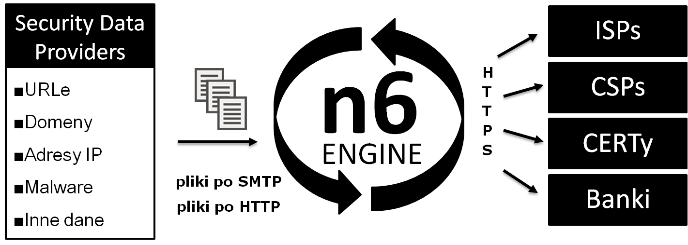
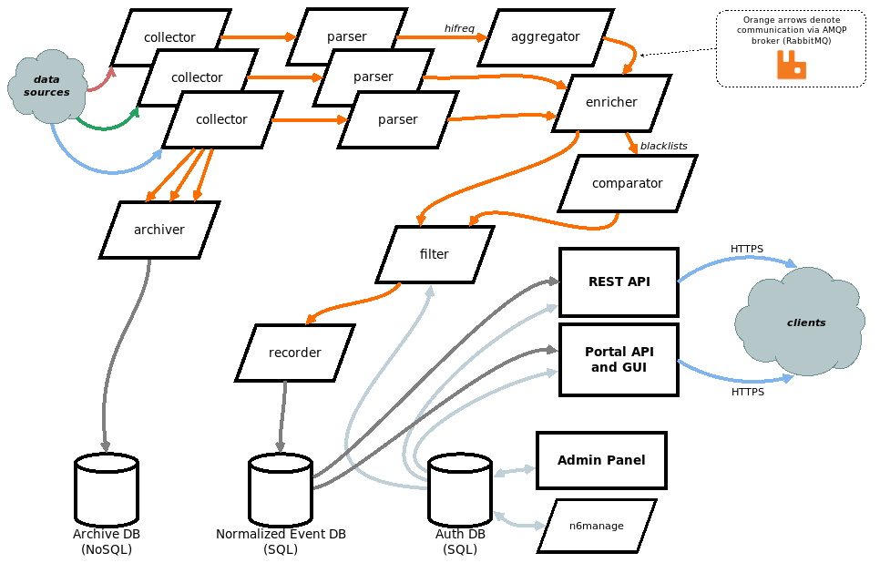
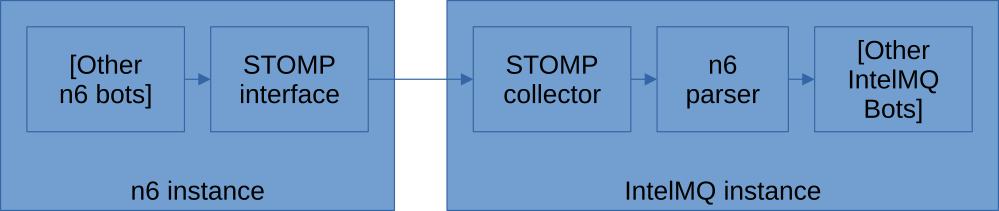
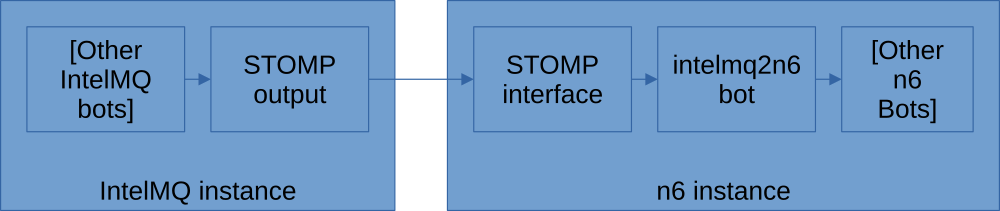

<!-- comment
   SPDX-FileCopyrightText: 2015-2023 Sebastian Wagner, Filip Pokorný
   SPDX-License-Identifier: AGPL-3.0-or-later
-->

# IntelMQ - n6 Integration

n6 is an Open Source Tool with very similar aims as IntelMQ: processing and distributing IoC data. The use-cases,
architecture and features differ and both tools have non-overlapping strengths. n6 is maintained and developed
by [CERT.pl](https://www.cert.pl/).

Information about n6 can be found here:

- Website: [cert.pl/en/n6](https://cert.pl/en/n6/)
- Source Code:
  [github.com/CERT-Polska/n6](https://github.com/CERT-Polska/n6/)
- n6 documentation: [n6.readthedocs.io](https://n6.readthedocs.io/)

## Data format

The internal data representation differs between IntelMQ and n6, so any data exchange between the systems requires a
format conversion. For example, in n6 one message can contain multiple IP addresses, but IntelMQ is intentionally
restricted to one IP address per message. Therefore, one n6 event results in *one or more* IntelMQ events. Because of
this, and some other naming differences and ambiguities, the format conversion is *not* bidirectional.

## Data exchange interface

n6 offers a STOMP interface via the RabbitMQ broker, which can be used for both sending and receiving data. IntelMQ
offers both a STOMP collector bot for receiving data from n6, as well as a STOMP output bot for sending data to n6
instances.

- Stomp Collector Bot
- N6 Parser Bot
- Stomp Output Bot

## Data conversion

IntelMQ can parse n6 data using the n6 parser and n6 can parse IntelMQ data using the Intelmq n6 parser.

- N6 Parser Bot

## Complete example

### Data flow n6 to IntelMQ

### Data flow IntelMQ to n6

### CERT.pl Data feed

CERT.pl offers data feed available to their partners through the STOMP interface. Our feeds documentation contains
details how it can be enabled in IntelMQ: [CERT.pl n6 STOMP stream](../../user/feeds.md#n6-stomp-stream)

### Webinput CSV

The IntelMQ Webinput CSV software can also be used together with n6. The documentation on this component can be found in
the software's repository:
<https://github.com/certat/intelmq-webinput-csv/blob/master/docs/webinput-n6.md>
