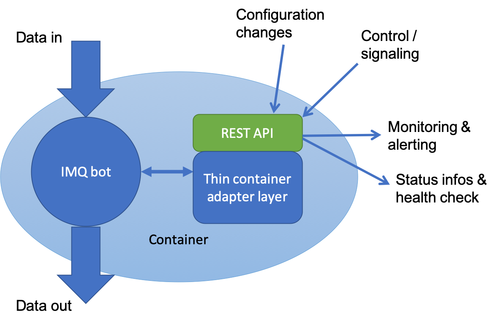

# Design Ideas for INTELMQ 3.0


# Motivation & Introduction

IntelMQ was created as a viable, easier alternative to Abusehelper roughly 2014/2013. 
At this time, the fathers of IntelMQ (Tomas Lima, then CERT.pt, Aaron Kaplan, CERT.at) focused on easy ("KISS principle") to understand code and open source.

In the mean time, IntelMQ became a de-facto standard for automatic incident handling for many European CERTs.

However, the success also resulted in IntelMQ being used in contexts which were not anticipated. Also, running a production instance of IntelMQ gave us new requirements - mainly from the side of running it within a corporation or larger team where operations of systems is separated from the development side.
On the other hand, as more teams started to use IntelMQ, weaknesses with respect to user-friendliness became apparent.

In short, IntelMQ needs to support more standard processes which can be found in regular IT operations: monitoring & alerting, central logging & control, scalability sizing , containerisation etc. It also needs to behave more as expected "turn-key" out of the box. This means, less configurations should be needed. This can be achieved by integrating it better with the existing most commonly used operations tools that teams use (e.g. centralized monitoring and alerting, etc). The main point however is: **It needs to be more user-friendly!**.

In addition, there seems to be the trend to connect different CERTs / IT security teams with each other (also on a data flow basis). IntelMQ is an ideal tool for that, however, most installations are currently set up as silos. Cross connecting them, adds extra requirements. 

The following proposal shall address these issues and is meant as a basis for discussion with the IntelMQ users.

If something is missing from the list, if something is not important at all or very important, etc. please let us know.

We are happy to receive your feedback.

Aaron Kaplan  - IntelMQ 3.0 Architecture.
kaplan@cert.at


# Overall architecture

The overall architecture of IntelMQ 3.0 will remain rather similar.

It will still keep the focus on:
  * keeping things simple (KISS) and pluggable: our most important principle
  * being a framework and thus adaptable and extensible by teams
  * being open source
 
 New architecture features will be:
  * Docker support
  * Better integration into existing best practice monitoring & alerting tools (prometheus, check_mk, etc.) via new intelmq_statusd
  * Kafka support
  * Better support for multiple data outputs:
    * Better support for ELK (Elastic Search, Logstash, Kibana) out of the box
    * Better support for Splunk out of the box
    * Cassandra output
    * Output to IDS / IPS systems out of the box
    * CSV output (as trivial as it might sound) -> often this is the best for data analysis
  * Better support for handling sensor data: potentially high volume streams of honeypots or other sensors shall be easily connectable.
  * Seamless interoperability with CERT Polska's n6 system
  * A vastly improved and extended internal format (DHO): we will support multiple values per key (think: key -> list or key -> dict). This is probably the change with the most impact.
  * Support for handing over data via to other tools and/or CERTs via dedicated exchange points: these shall serve as the glue between different DHO format versions or between different data exchange formats (for example : n6 <-> DHO)
  * Adding the concept of verifies: think of these as expert bots which can verify a claim made in the DHO event. Example: the event talks about a webserver having an outdated SSL setting (Poodle vuln for example): the verified (if enabled!) should be able to reach out to the server and confirm the claim. This may be the basis for some kind of confidence score for the claim made in the event.
  * the concept of transcoders: should input arrive in a certain code page, a transcoder can trivially convert it to for example utf-8
  * the concept of transformers: convert one data format (f.ex. STIX) to the internal format and vice-versa
  * and of course: more data feeds supported. See for example https://github.com/gethvi/intelmq/blob/develop/docs/Feeds-whishlist.md
  
  
 
## Microservice architecture / Docker support
 
 Due to the request (and the current practice ) of many teams, we will add Docker support. Many teams already implemented this in one way or the other. However, there is no uniform standard way in IntelMQ yet to run it in a container stack (possibly as microservice).
 We will try to address this in Version 3.0 in a standardised way which fits to multiple teams.
 
 The most important finding while doing interviews with multiple IntelMQ users was, that intelmqctl is used as a control channel, however, it would make more sense to have a type of "intelmq_statusd" (daemon) process which does not need to be invoked for every query (as is the case with the command line intelmqctl script). The intelmq_statusd would povide a short and lean RESTful API to the outside world, which will manage signaling of the bot / botnet and be able to query a bot's or botnets' status. See the architecture diagram below.
 




The high level goals of using a micro service architecture for IntelMQ 3.0 are:

  * we want to be highly maintainable on an individual (bot- or functionality) level
  * we want to be able to quickly test out a setting (docker-compose up ...) 
  * we want to be highly testable in a _standardized_ way. Calling a test function for a bot shall be identical. Tests consist of a) unit tests of the microservice but also b) of integration tests of the micro service with its environment. The self-test shall be run on the current config of the bot/container.
  * a micrsoservice allows for self-inspection: within the context of IntelMQ's bots this means that a bot knows which input it needs to be able to work properly (i.e. which DHO fields are filled out) and which fields it produces. This allows for integration tests.
  * bots must be independently deployable and a deployment must be *self-contained*.  No fiddling should be needed. It should be as easy as docker-compose ... if a microservice needs to install or fetch external resources (example a DB) before it is ready, it shall do that in the init() function and only then report that it is finished.
  * each micro service MUST focus on one and only one task and excel at doing it
  * each micro service MUST be maintained by a small team. One developer is not enough. There shall be a clear point of contact relationship for each micro service, hence... Think metadata on a bot/container. 
  * a micro service is registered at a registry of IntelMQ 3.0 micro services (which must contain the latest version number, contact info for the developer team, etc)
  * a microservice MUST support service discovery. It shall register itself at some orchestrator - compare with registry.
  * a microservice MUST support monitoring tools (splunk, prometheus, check_mk, etc) and report its status to a monitoring tool
  * a microservice MAY support Identity mgmt tools via OpenID Connect on its' API
  * a microservice MUST be very easily integratable in other frameworks and work-flows. Think: IntelMQ 3.0 micro service components may run (as micro services) within a bigger data processing tool.
  

All of these requirements point towards a container architecture with standardised RESTful API endpoints.
The RESETful API SHOULD be implemented on the basis of the OpenAPI specs.
(Note: look at JSON API specs)

### Storage of the Docker image

Often, when deploying docker a relevant question arises: where is data stored? In our case, this is quite easy:

  * most data stays in the MQ bus
  * config data is on disk (in the docker image)
  * DB is external of storage (as it is now with for example the postgresql-output)

Using the docker template bot, a bot needs to connect to the provided software layers which interface the functionalities described above


### RESTful API requirements

  
  * It must be well documented (OpenAPI specs)
  * an example hello world with the API exists on GitHub

  * The micoservice API MUST support 
    * basics:
      * starting/stopping/reload/restarting/pausing a bot 
      * inspecting and setting it's runtime parameters of the bot
      * getting version infos and meta-information on the bot + container
        * especially a list of required input fields and produced output fields (-> introspection)

    * tests:
      * triggering a config test (bot intelmqctl configtest)  --> are the runtime params OK, internal python bot config test. No connections are made
           https://<url-of-my-docker-container>/api/v1/self-test/config-test
      * triggering a connectivity test (i.e. can it send/receive data? connections to DBs)
          Are all required connections (redis, DB, input / output of network ) ready?
        https://<url-of-my-docker-container>/api/v1/self-test/connection-test

      * triggering a self-test (unit-test)
          python unit tests

      * triggering a system-test (i.e. does it get the data that it needs? can it do its task and can it send out the data that it sends out?)
          actually check if it can/could get all the input fields it needs. This is a global test. The MS can send the field names it needs and the field names it produces.


    * connectivity:
      * API endpoints for configuring the pipeline of the bot as well as the MQ stack


    * operations specifics:
      * an API endpoint to dump the current state of the bot to disk so that this container may be paused and migrated to a different system.  --> TBD
      * monitoring information (health check, alerts, data rates of the flows, error counters, etc)
      * registering callbacks (or configuring the necessary infos) for a monitoring solution such as check_mk, nagios
(introspection)
      * report (in the documentation) on the rough requirements on RAM, disk space, CPU load etc. - think base-line 
      * endpoints for configuring syslog flows (where should the bot send it to)
      * Data freshness check is built-in (to be defined below)

    * IAM / Authentication & Authorization
      * If authentication is needed, a Bot SHOULD support OpenID connect on it's REST interface 
      * MAYBE also  setting encryption settings on the M2M interface (the MQ) ?

    * developer support
     XXX ideas? XXX
      * how can we expose / should we expose the debug method of the bot to the container?


### Example RESTful API interface.


We don't care which API framework you want to use (hug, fast api, flask, ...)
What we do care about is the RESTful API interface: 
See https://github.com/gethvi/intelmq/blob/develop-api/docs/REST-API.md


### An IntelMQ 3.0 docker-bot now consists of:

  1. the IntelMQ bot per se (and corresponding libraries)
  2. the means to connect the container and bot to other containers/bots
  * the means to instrument the data flowing in and -out (--> monitoring)
  * the means to replace the connection / MQ stack (on a per bot / container level).
    
  * a standard test 
  * self-reporting to a central instance (orchestrator / registry)
  * standardised logging
  * standardised self-test
  * integration into check_mk or other monitoring solution
  * standardised REST-api for the bot (start, stop, status)
  * status queries to the bot (health, number of events/sec, etc)
  * test "would this botnet setup work?" / test if a bot in this pipeline could function (-- > introspection of what data is needed for the bot and what data it provides)
  * docker scale it horizontally --> data processing bottlenecks? --> horizontal scaling should be a click of a button
  * standardised way to self-update any external dependencies (maxmind, etc) & report alert if something goes wrong
  * standardised alerting mechanism (--> check_mk for nic.at)


### Data freshness

  * check if the needed databases (for example maxmind) is the latest version and download it if needed
  * self-updates per se are *not* supported. Patching must be done from the outside.


# Other features 

## MQ: Replaceable MQ & support for Kafka

We will support Kafka as a MQ bus. Any other MQ buses which are urgently needed?


## Multiple data outputs

* Better support for ELK (Elastic Search, Logstash, Kibana) out of the box
* Better support for Splunk out of the box
* Cassandra output
* Output to IDS / IPS systems out of the box
* CSV output (as trivial as it might sound) -> often this is the best for data analysis

## Inputs
* Better support for handling sensor data: potentially high volume streams of honeypots or other sensors shall be easily connectable.

## n6 Interoperability

  * Seamless interoperability with CERT Polska's n6 system
  
## A new DHO version

  * A vastly improved and extended internal format (DHO): we will support multiple values per key (think: key -> list or key -> dict). This is probably the change with the most impact. This task is highly dependant and basically the core of the n6<-> intelmq interoperability.
  
A new DHO version implies that some old installations of IntelMQ might still expect the old format. There are multiple ways to address this. The easiest solution looks like to have dedicated hand over points:

  * Support for handing over data via to other tools and/or CERTs via dedicated exchange points: these shall serve as the glue between different DHO format versions or between different data exchange formats (for example : n6 <-> DHO)
  
 This goes together with:
   * transcoders and transformers
   * a version field in a DHO event (for the new DHO version): if it is missing, it's an old DHO event. Example:
  
  
```json
{ "meta-data": { "version": 2.0, "created-at": "2020/5/1 12:00:00+0", "producer": "cert.at" }, "data": { ... } }
```
  * machine readable specs of the DHO 2.0
  * mapping of DHS 2.0 to other formats


## Verifiers
  
  * Adding the concept of verifies: think of these as expert bots which can verify a claim made in the DHO event. Example: the event talks about a webserver having an outdated SSL setting (Poodle vuln for example): the verified (if enabled!) should be able to reach out to the server and confirm the claim. This may be the basis for some kind of confidence score for the claim made in the event.
  
  * and of course: more data feeds supported. See for example https://github.com/gethvi/intelmq/blob/develop/docs/Feeds-whishlist.md
  
  
## Transcoders

A new class of bots.

Convert one code page to another
Should input arrive in a certain code page, a transcoder can trivially convert it to for example utf-8


## Transformers

new class of bots: transform one data format (e.g. DHO) to another one (e.g. IDEA) or n6 <-> DHO


## Outputs: Really good out of the box support for ELK and Splunk 

See for example the previous work by https://github.com/gethvi/intelmq/blob/develop/docs/ELK-Stack.md


## Internal code: more modern python version with typing. Typing and type hints support in all of the code base

* mostly done. The core already supports the most important functions.

## n6 interoperability

It should be possible to run an n6 bot within an intelMQ botnet setup and vice versa.


## domain based workflow

Currently, most of the workflows for IntelMQ address number based processing (e.g. IP addresses).
However, name based workflows (domain names) often have slightly different requirements. For example: URL of a hacked web page -> it would be good to create a screenshot of the hacked web page in order to show it to the web page operator, so that he understands what happened to his/her web page. This task will address these requirements.

## portal-integration?

Minimal: re-inspect the contactdb expert.


TODOs Aaron
=============
* add pics / better explanations

* post to IHAP and intelmq-users/+dev

TODOs sebix
===========
* cross check with CEF proposal


