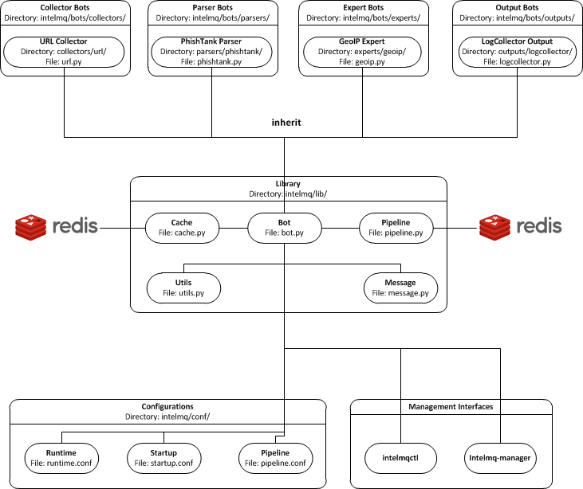

<!-- comment
   SPDX-FileCopyrightText: 2015-2023 Sebastian Wagner, Filip Pokorný
   SPDX-License-Identifier: AGPL-3.0-or-later
-->

# System Overview

In the `intelmq/lib/` directory you can find some libraries:

-   Bots: Defines base structure for bots and handling of startup, stop,
    messages etc.
-   Cache: For some expert bots it does make sense to cache external
    lookup results. Redis is used here.
-   Harmonization: For defined types, checks and sanitation methods are
    implemented.
-   Message: Defines Events and Reports classes, uses harmonization to
    check validity of keys and values according to config.
-   Pipeline: Writes messages to message queues. Implemented for
    productions use is only Redis, AMQP is beta.
-   Test: Base class for bot tests with predefined test and assert
    methods.
-   Utils: Utility functions used by system components.

### Code Architecture

