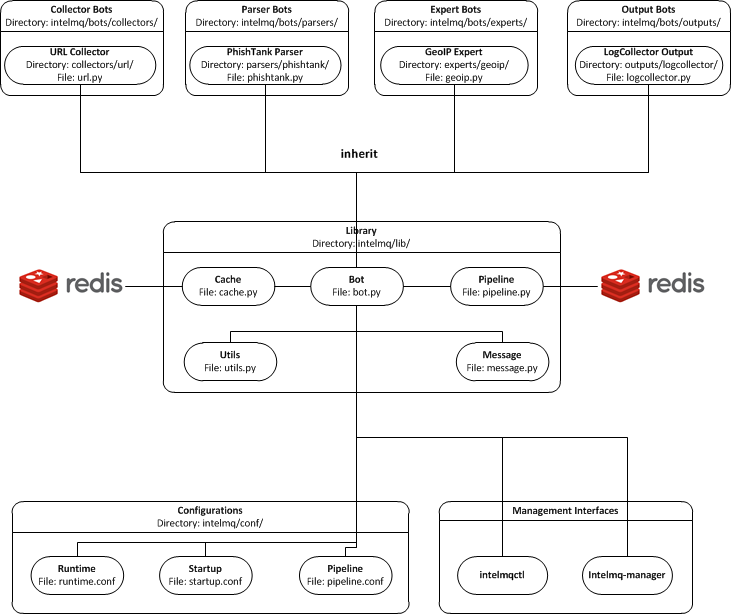

<!-- comment
   SPDX-FileCopyrightText: 2015-2021 nic.at GmbH, 2022-2025 Institute for Common Good Technology
   SPDX-License-Identifier: AGPL-3.0-or-later
-->

# System Overview

In the `intelmq/lib/` directory you can find some libraries:

-   Bots: Defines base structure for bots and handling of startup, stop,
    messages etc.
-   Cache: For some expert bots it does make sense to cache external
    lookup results. Redis is used here.
-   Harmonization: For defined types, checks and sanitation methods are
    implemented.
-   Message: Defines Events and Reports classes, uses harmonization to
    check validity of keys and values according to config.
-   Pipeline: Writes messages to message queues. Implemented for
    productions use is only Redis, AMQP is beta.
-   Test: Base class for bot tests with predefined test and assert
    methods.
-   Utils: Utility functions used by system components.

### Code Architecture



## Directories Hierarchy on Default Installation

- Configuration Files Path: `/opt/intelmq/etc/`
- PID Files Path: `/opt/intelmq/var/run/`
- Logs Files and dumps Path: `/opt/intelmq/var/log/`
- Additional Bot Files Path, e.g. templates or databases:
  `/opt/intelmq/var/lib/bots/[bot-name]/`

## Repository and software file layout

This is the directory and file structure of the layout including a brief description of their meanings.
For a better overview, some details are left out.

* `contrib/` (collection of useful tools related to IntelMQ, but not officially part of it and not necessarily well-tested or maintained)
* `debian/` (Packaging definitions and rules for Debian-based distributions)
* `docs/` (the documentation you are reading right now)
	* `admin/` (for IntelMQ system administration)
	* `dev/` (for IntelMQ development)
	* `user/` (for IntelMQ usage)
* `intelmq/`
	* `bin/`
		* `intelmqctl.py` (the primary command line interface `intelmqctl`)
		* `intelmqdump.py` (for handling bot dump files)
	 * `bots/`
		 * `collector/`
			 * `<provider/protocol>`
				 * `collector_<service>.py`
		 * `parser/`
			 * `<feed provider>`
				 * `parser_<feed>.py`
		 * `expert/`
			 * `<service provider>`
				 * `expert_<service>.py`
		 * `output/`
			 * `<service/protocol>`
				 * `output_<service>.py`
	 * `etc/`
		 * `runtime.yaml` (default configuration)
		 * `feeds.yaml` (documented supported feeds)
		 * `harmonization.conf` (default data format fields specification)
	 * `lib/` (IntelMQ's internal libraries)
		 * `bot.py` (bot class definitions)
		 * `cache.py`
		 * `datatypes.py`
		 * `exceptions.py`
		 * `message.py` (message class definitions including Report and Event)
		 * `pipeline.py` (handling of the message queue aka "pipeline")
		 * `processmanager.py`
		 * `upgrades.py`
		 * `utils.py` (utility functions)
		 * `mixins/` (Additionally helper classes for bots)
			 * `cache.py`
			 * `http.py`
			 * `sql.py`
			 * `stomp.py`
	 * `tests/` (IntelMQ unit tests)
		 * `assets/` (assets used in multiple tests)
		 * `bin/`
		 * `lib/`
		 * `bots/`
			 * same structure as in `intelmq/bots/`

### Bot naming conventions

Assuming you want to create a bot for a new 'Abuse.ch' feed.
It turns out that here it is necessary to create different parsers for the respective kind of events (e.g. malicious URLs).
The solution is to use one directory for the feed provider (Abuse.ch) and multiple parser files named like the feed name, separated by underscore.

Example for multiple parses related to one feed provider:

```
/intelmq/bots/parser/abusech/parser_domain.py
/intelmq/bots/parser/abusech/parser_ip.py
/intelmq/bots/parser/abusech/parser_ransomware.py
/intelmq/bots/parser/abusech/parser_malicious_url.py
```

The same applies to other buts types and also services or protocols. E.g. there are two HTTP collectors (a "normal" one and a stream collector) or two Microsoft collectors (supporting two different APIs).

Any directory name and file name of IntelMQ has to:

- be represented with lowercase and in case of the name has multiple words, the spaces between them must be removed or replaced by underscores
- be self-descriptive what the content contains
