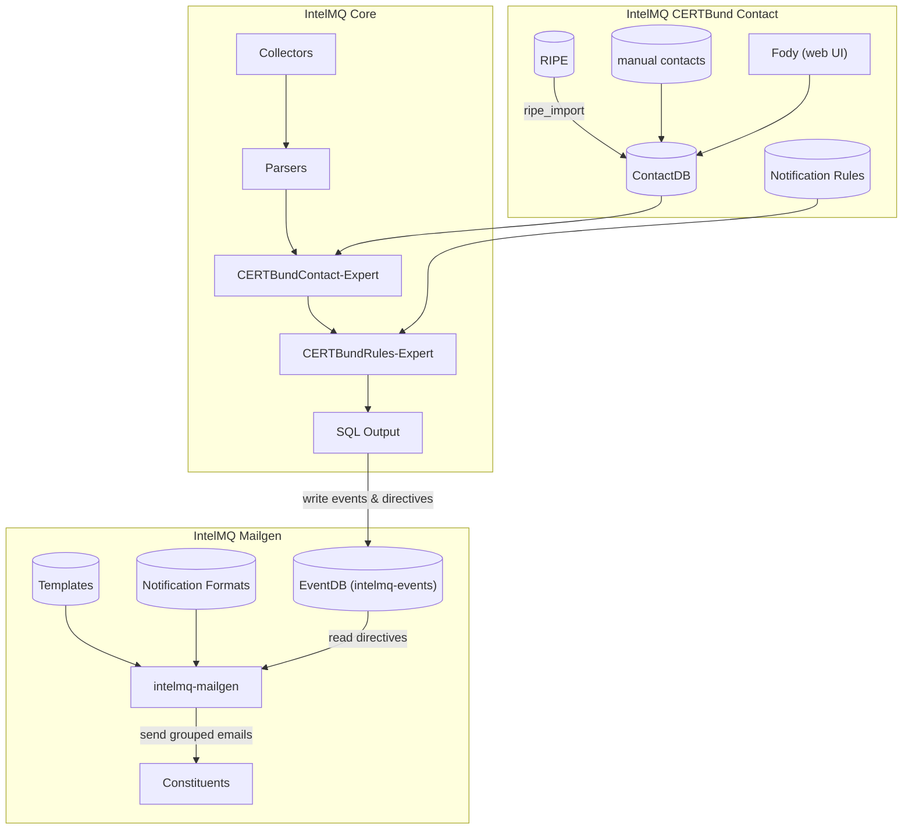
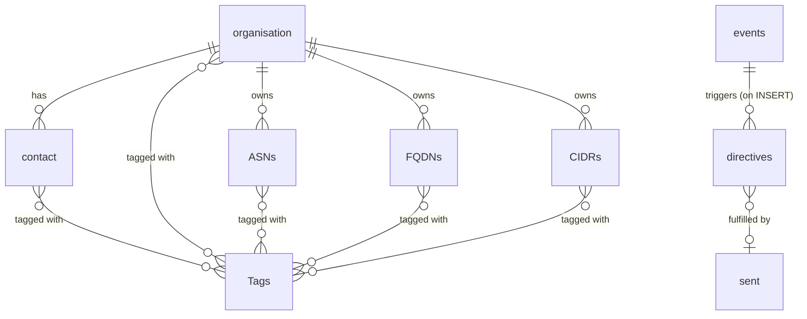
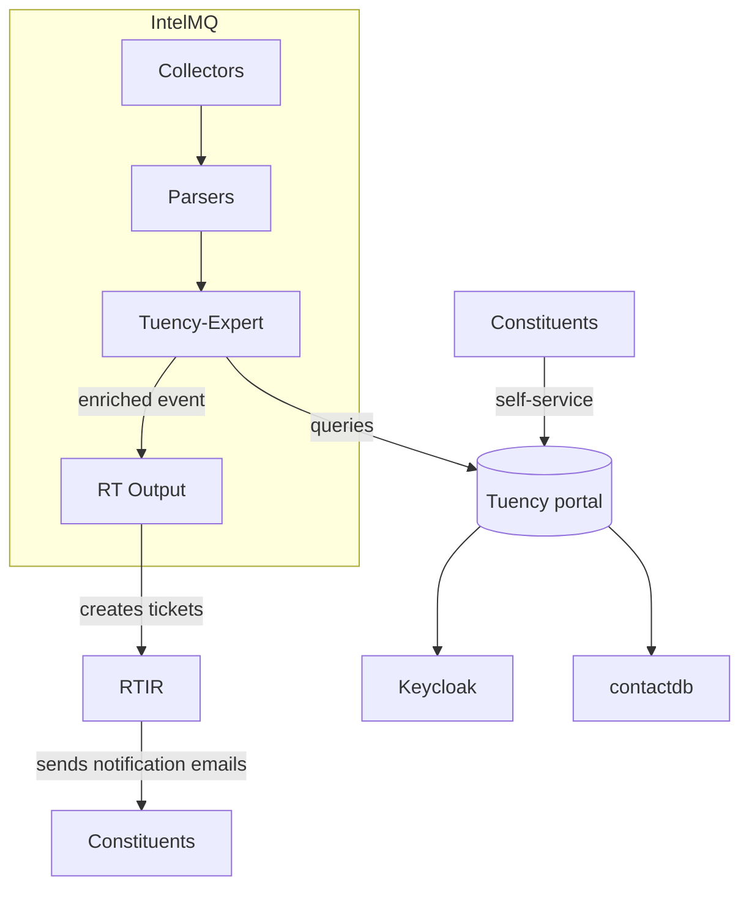
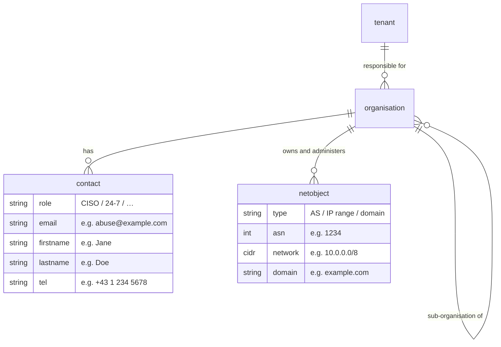

<!-- comment
   SPDX-FileCopyrightText: 2021 CERT.at GmbH, 2023 Filip Pokorný, 2026 Institute for Common Good Technology
   SPDX-License-Identifier: AGPL-3.0-or-later
-->

# Abuse-contact look-ups

Choosing the right notification contact for a security incident or vulnerability is essential to getting it resolved quickly.
The correct contact depends on the incident type: a device vulnerability is best reported to the hosting provider (who can reach the server administrator), while a defacement or phishing site is better directed to the domain owner responsible for the content.

Different organisations also have different contact databases and workflows.
A SOC typically manages contacts for its own organisation and subsidiaries, while a national CSIRT covers all networks within a country.
IntelMQ supports both scenarios: it offers multiple tool suits and can query multiple abuse-contact sources and combine the results.

Management suites for constituencies, contacts and network objects provide the highest-quality contact data because network owners maintain it themselves.
Public sources like RIPE are broader and less precise, but provide a very good base and are also suitable for finding related infrastructure in the first place.

The RIPE document [Sources of Abuse Contact Information for Abuse Handlers](https://www.ripe.net/publications/docs/ripe-658) gives a thorough overview of the available sources and their trade-offs.

## Suites for contact management and CRM

There are two established integrated solutions for managing contacts and networks.
Both of them are made for and integrated in IntelMQ.
They share also parts of their database models and the RIPE import tooling.

### CERTBund

The CERTBund suite was originally created for [CERTBund](https://www.cert-bund.de/) and provides a dual level contact management for automatic and manual contacts.
The processing is highly configurable by user-defined rules and formatting scripts.

- [Documentation](https://intevation.github.io/intelmq-mailgen/)
- [Installation](../admin/installation/combined.md)
- The [combined installation documentation](../admin/installation/combined.md) includes the installation of this suite

It consists of these components:

- [`intelmq-certbund-contact`](https://github.com/Intevation/intelmq-certbund-contact/): two IntelMQ expert bots (Contact-Expert and Rule-Expert) that enrich events with contact information from the contact database.
  Based on user-defined rules they determine the recipient, email template, and attachment format.
	- RIPE import scripts keep contact data up to date automatically.
- [`intelmq-fody`](https://github.com/Intevation/intelmq-fody) & [`intelmq-fody-backend`](https://github.com/Intevation/intelmq-fody-backend): web interface for reading and editing contacts, querying sent notification tickets, and browsing the IntelMQ event database.
- [`intelmq-mailgen`](https://github.com/Intevation/intelmq-mailgen): tool that reads the notification directives written by the CERTBund experts and sends grouped event emails to the determined contacts.
  Supports OpenPGP encryption, formatting is configured by scripts and templates.
- `contactdb`: The PostgreSQL database that covers Autonomous Systems, network ranges (CIDR), single IP addresses, and domains.

**Data model:**

Contrary to tuency, there is no hierarchy of organisations.

### Tuency

[Tuency](https://gitlab.com/intevation/tuency/tuency) is a constituency portal that lets organisations self-administer their network objects and notification preferences.
It is maintained by [CERT.at](https://cert.at).

- [Source Code](https://gitlab.com/intevation/tuency/tuency)
- [Documentation](https://tuency.cert.at/docs/)

**Components**

- **Tuency portal**: Web application where constituency members manage their organisations, network objects, and notification rules. Organisations can claim network objects (ASes, IP ranges, domains) themselves, all changes require approval by a tenant admin to prevent hostile takeovers and incorrect data.
- [**Keycloak**](https://www.keycloak.org/): Handles authentication for the Tuency portal and enables single sign-on with other tools in the stack.
- **[Request Tracker for Incident Response](https://bestpractical.com/rtir/) (RTIR)**: Ticketing system used to manage incidents and send notification emails to constituents. The `intelmq.bots.outputs.rt.output` bot creates an Incident ticket in RTIR for each event, and optionally a linked Investigation ticket containing the event details that RTIR then delivers to the contact in `source.abuse_contact`.
- [**intelmq extensions**](https://github.com/certat/intelmq-extensions/tree/main/intelmq_extensions/bots):
	- Custom harmonization fields in the IntelMQ data format definition that are required by the workflow
	- Tools to create tickets RTIR and deliver notifications to constituents
	- Tuency Expert: IntelMQ expert bot that queries the Tuency API to retrieve the appropriate abuse contact and notification interval.

**Data model:**

- **Tenant** (constituency): a sector CSIRT responsible for a set of organisations. Tuency supports multiple tenants.
- **Organisation**: belongs to a tenant and owns network assets, can have sub-organisations to reflect internal hierarchies.
- **Contacts**: assigned roles such as CISO or 24/7 support, tied to a single organisation.
- **Netobjects** (Network objects): Autonomous Systems, IP address ranges (CIDR), and domains owned and administered by an organisation. All claims go through an approval process.

The hierarchical model allows three privilege tiers to control access and organise permissions:
- Orgadmin (organisation admins) that manage their own organisation and all of their sub-organisations
- Tenantadmin manage all organisations in their tenant (constituency)
- Portaladmins manage all organisations in all tenants

## Sources for abuse-contacts

The following bots can be combined to build custom contact lookup workflows.
A common pattern is to use high-quality data sources as CERTBund and Tuency first, and fall back to generic public sources for any network resources that are not covered by the internal data sources.

Unless noted otherwise, each bot writes its result to `source.abuse_contact`.

### Domain-based

- `intelmq.bots.experts.rdap.expert` queries private and public RDAP servers for `source.fqdn`.
- `intelmq.bots.experts.trusted_introducer_lookup.expert` looks up the TLD or domain (first match) of `source.fqdn` in a locally cached [Trusted Introducer team directory](https://www.trusted-introducer.org/directory/teams.json).

### IP address / ASN-based

- `intelmq.bots.experts.abusix.expert` queries the online [Abusix](https://abusix.com/) service.
- `intelmq.bots.experts.do_portal.expert` queries an instance of the do-portal software (deprecated).
- `intelmq.bots.experts.tuency.expert` queries a [Tuency](#tuency) constituency portal. Also retrieves notification rules, which are stored in `extra.ttl`.
- `intelmq.bots.experts.ripe.expert` queries the online RIPE database for IP address and ASN contacts.
- `intelmq.bots.experts.trusted_introducer_lookup.expert` looks up `source.asn` in a locally cached [Trusted Introducer team directory](https://www.trusted-introducer.org/directory/teams.json).

### Generic and local sources

- `intelmq.bots.experts.generic_db_lookup.expert` queries a local database table, e.g. a mapping from ASNs or country codes to abuse contacts.
- `intelmq.bots.experts.uwhoisd.expert` fetches raw WHOIS data, does not extract an abuse contact itself.

## Helpful other bots for pre-processing

- `intelmq.bots.experts.asn_lookup.expert` queries locally cached database to lookup ASN.
- `intelmq.bots.experts.cymru_whois.expert` to lookup ASN, Geolocation, and BGP prefix
  for `*.ip`.
- `intelmq.bots.experts.domain_suffix.expert` to lookup the public suffix of the domain
  in `*.fqdn`.
- `intelmq.bots.experts.format_field.expert`
- `intelmq.bots.experts.gethostbyname.expert` resolve `*.ip` from `*.fqdn`.
- `intelmq.bots.experts.maxmind_geoip.expert` to lookup Geolocation information for `*.ip`
  .
- `intelmq.bots.experts.reverse_dns.expert` to resolve `*.reverse_dns` from `*.ip`.
- `intelmq.bots.experts.ripe.expert` to lookup `*.asn` and Geolocation information
  for `*.ip`.
- `intelmq.bots.experts.tor_nodes.expert` for filtering out TOR nodes.
- `intelmq.bots.experts.url2fqdn.expert` to extract `*.fqdn`/`*.ip` from `*.url`.

## Combining the lookup approaches

In order to get the best contact, it may be necessary to combine multiple abuse-contact sources.
IntelMQ's modularity provides methods to arrange and configure the bots as needed.
Among others, the following bots can help in getting the best result:

- `intelmq.bots.experts.filter.expert` Your lookup process may be different for different types of data. E.g. website-related issues may be better addressed at the domain owner and device-related issues may be better addressed to the hosting provider.
- `intelmq.bots.experts.modify.expert` Allows you to set values based on filter and also format values based on the value of other fields.
- `intelmq.bots.experts.sieve.expert` Very powerful expert which allows filtering, routing (to different subsequent bots) based on if-expressions . It support set-operations (field value is in list) as well as sub-network operations for IP address networks in CIDR notation for the expression-part. You can as well set the abuse-contact directly.
