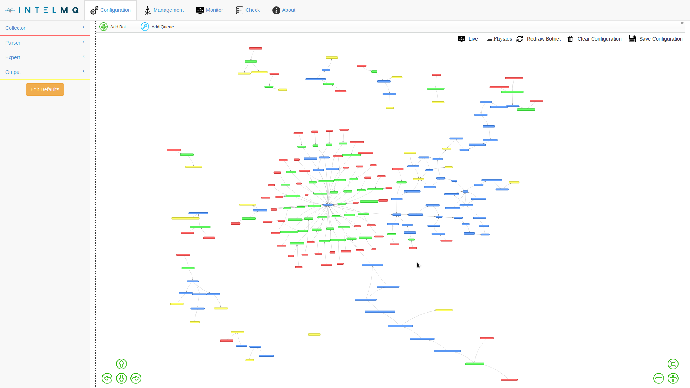
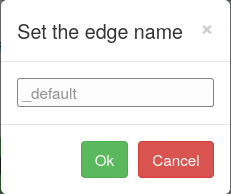
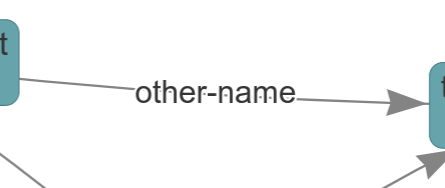
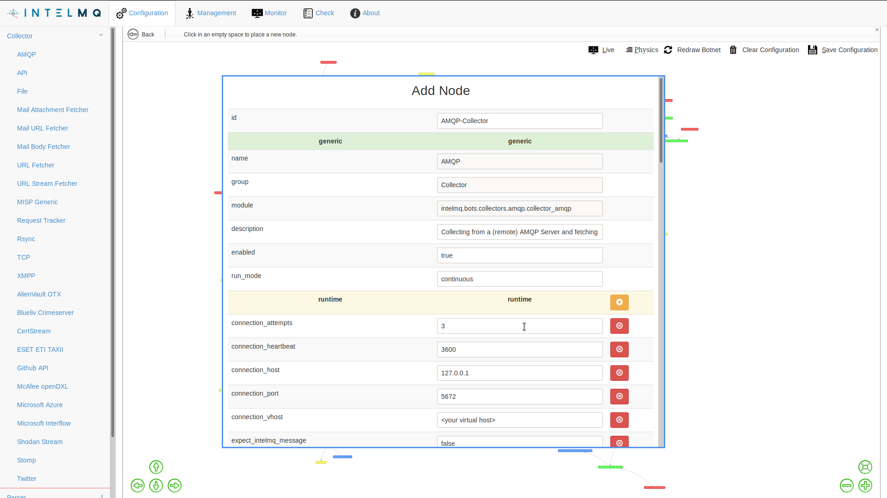
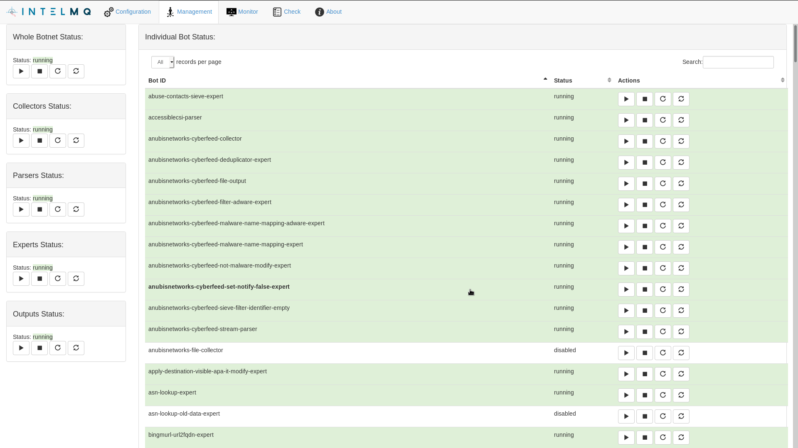
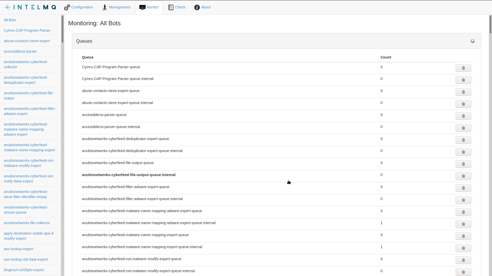
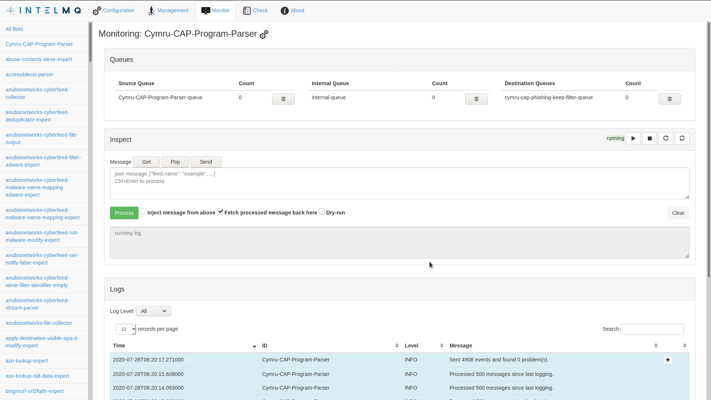

<!-- comment
   SPDX-FileCopyrightText: 2015-2023 Sebastian Wagner, Filip Pokorný
   SPDX-License-Identifier: AGPL-3.0-or-later
-->

# Using IntelMQ Manager
**IntelMQ Manager** is a graphical interface to manage configurations for IntelMQ. It's goal is to provide an intuitive tool to allow non-programmers to specify the data flow in IntelMQ.

## Configuration Pages

### Pipeline

This interface lets you visually configure the whole IntelMQ pipeline
and the parameters of every single bot. You will be able to see the
pipeline in a graph-like visualisation similar to the following
screenshot (click to enlarge):

#### Named queues / paths

With IntelMQ Manager you can set the name of certain paths by double-clicking on the line which connects two bots:

The name is then displayed along the edge:

### Bots Configuration

When you add a node or edit one you will be presented with a form with the available parameters for the bot. There you can easily change the parameters as shown in the screenshot:

After editing the bot's configuration and pipeline, simply click **Save Configuration** to automatically write the changes to the correct files. The configurations are now ready to be deployed.

!!! warning
    Without saving the configuration your changes will be lost whenever you reload the web page or move between different tabs within the IntelMQ manager page.

### Botnet Management

When you save a configuration you can go to the **Management** section to see what bots are running and start/stop the entire botnet, or a single bot.

### Botnet Monitoring

You can also monitor the logs of individual bots or see the status of
the queues for the entire system or for single bots.

In this next example we can see the number of queued messages for all
the queues in the system.

The following example we can see the status information of a single bot.
Namely, the number of queued messages in the queues that are related to
that bot and also the last 20 log lines of that single bot.

## Keyboard Shortcuts

Any underscored letter denotes access key shortcut. The needed
shortcut-keyboard is different per Browser:

-   Firefox: ++ctrl+alt++ + Letter
-   Chrome & Chromium: ++alt++ + Letter